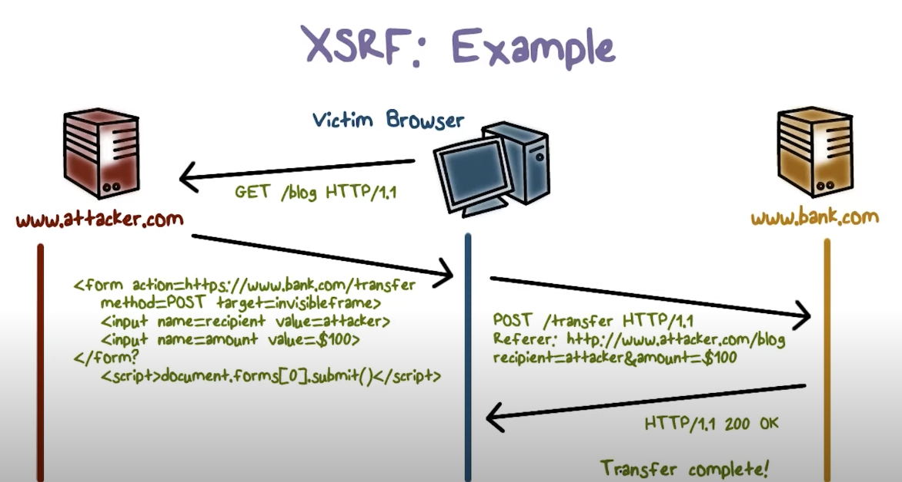

# Programming and software development

> Development of software solutions, specifics of implementing web-based information systems. Tools and environments for software development of large-scale systems. Basic concepts of software architectures from an implementation perspective. Multilayer architecture of modern information systems, model-view-controller architecture. Persistence, ORM. Practical examples for all of the above. (PA165 || PV179)

## Development of software solutions

- Development se sklada z nekolika kroku (pripomina waterfall model):

  - Zvoleni metodologie, ve ktere bude development probihat (**Agile, RAD, Waterfall**)
  - **(Analysis)** Sber pozadavku - Existujici system? Potreby stakeholderu, Pozadovane standardy, Regulace zakonne, Domain informace
  - **(Design)** Navrhnuti designu
  - **(Coding)** Implementace designu
  - **(Testing)** Testovani systemu - Akceptacni testovani, integracni testovani, unit testovani, performance testovani, sanity testovani (po uplatneni patche), smoke testovani (core features funguji), ...
  - **(Deployment)** Nasazeni systemu
  - Optional: Migrace dat - pokud existuje stara aplikace, migrace z existujiciho softwaru do noveho

- Dulezite je komunikace mezi klientem/zakaznikem a developerem, potreba shodnuti se na jednotnem/univerzalnim jazyku (Ubiquitous language)

  - V momente, kdy nedochazi k dodrzovani muze dochazet k neporozumneni

- U navrhu je dulezite po sberu vsech pozadavku definovat design (treba forma UML modelu), dale navrhnout public/internal APIs, definovat datovy model, uvazovat nad infrastrukturou (je treba premyslet nad rychlosti, bezpecnosti, skalovatelnosti)

  - Dokompozice na komponenty, co nejjednodussi system -> minimalizace zavislosti mezi jednotlivyma komponentama, dodrzovani **SOLID, DRY, KISS**
  - Komponenty maji dobre navrzene kontrakty (interfaces), dulezita je zavislost na kontraktech, ne na implementacich (**Dependency Inversion principle**)

- Nasazeni a kontonialni integrace systemu s vyuzitim (**CI/CD**), spousteni automatizovanych testu, obecne verzovani kodu

## Web-based information systems

- Webove aplikace jsou vetsinou **SaaS** (Software-as-a-service) aplikace
- Jsou nezavisle na zarizeni (pc, notebook, tablet, phone, hodinky, tv)
- Vetsinou se skladaji z vicero casti:
  - **Frontend:** Pristupny skrze prohlizec (HTML, CSS, JavaScript)
    - Fat/Thin client -> distribution of processing on the server
    - V minulosti spise multi-page -> rerendrovani pri kazdem pozadavku -> rerendrovani probihalo na serveru
    - 2010s - single-page nastup a **fat** client
    - Fat -> vice responzivity, ale vetsi zatez na vypocetni prostredky uzivatele, senzitivnejsi deplouyment environment
    - Prace s DOM (Document Object Model)
    - Momentalne trend static-site generation (pro prezentacni weby bez vetsi interaktivity)
  - **Backend:** Vykonavani aplikacni logiky, zpracovava pozadavky klienta, autentizace a autorizace (pokud nevyuziva 3rd party libku), obvykle je server bezstavovy. Pouzivaji se tradicni jazyky, ale i velmi popularni JavaScript (NodeJs)
  - **DB:** Perzistence dat, typy jsou relacni, nebo noSQL (objektova, grafova)

### Specifics

- **Snadnost aktualizace:** Deploy nove verze, uzivatel nic nestahuje
- **Responzivni rozhrani:** Pristup ze vsech zarizeni
- **Snaha o tenky klient:** Vetsina prace na serveru
- **Duraz na bezpecnost:** Pristup odkudkoliv, potreba spravne vyresit pristup (login, rights, registration a ukladani citlivych dat)
- **Dostupnost:** Velke mnozstvi uzivatelu = velky napor na infrastrukturu -> jak resit skalovani? Servery bezstavove, takze horizontalne neni problem (multiplikace nodes). U databazi spise vertikalne nebo distribuovane databaze (replikace dat nebo read/write db)
- **Architektura vetsinout klient-server:** Alternativa treba peer-to-peer

### Security

- **Authentication:** validace identity (prihlaseni)
  - Session based
  - Token based
  - Nejlepsi pristup je vyuzit 3rd party libraries jako OAuth, IdentityServer, Keycloak, Firebase Auth
  - Ukladani hesel v non-plain forme = hash (with salt)
- **Authorization:** specifikace prav (access rights)

#### Authentication technologies

- **HTML form based:** Formular, ktery se submitne a posle request (treba AJAX), flag prihlaseni ulozeny v HttpSession
- **HTTP basic:** Browser zasle username a heslo formou requestu `Authorization: Basic <encrypted username:password>`
- **TLS client certificate** Server ocekava od klienta certifikat (Klasicke TLS certifikace = server musi poslat certifikat, klient muze)
- **federated identity:** Trusted by multiple IT systems or organisations,
- **SAML:** Umoznuje prihlasit se jednou a pristupovat k vice aplikacim, predavani overovacich dat poskytovatelum sluzeb -> bezpecnejsi a snadnejsi pristupy (starsi nez OAuth a vyuziva XML)
- **OAuth:** "Open authorization", RFC 6749, otevreny standard specifikujici protokol pro autorizaci pristupu
  - How to: Zaregistrovat u poskytovatele (google, fb) -> ziskani `client_secret` -> prichod do aplikace = presmerovani na oauth server (zadost o opravneni) -> ziska od uzivatele jednorazovy kod -> vraci uzivateli za kod a client_secret TOKEN -> volani API s tokenem
- **OpenID Connect:** Federated identity layer on top of the OAuth 2.0, standardizovane API
- **HTTP DIGEST:** Enkodovani username a password pred zaslanim (ochrana citlivych informaci), ale pouziva zastaraly md5 hashing algoritmus a HTTP protocol
- **Kerberos:** sitovy autentizacni protokol, bezbecna komunikace i na nezabezpecene siti -> symetricka kryptografie, potreba duveryhodne treti strany

### Attacks

- **SQL injection**: utocnik vlozi jako input do SQL dotazu specialni kombinaci k zpristupneni dat/smaze data/upravi data/prida data (noveho usera s adminem..)
- **Session hijacking**: ziskani cookies nekoho jineho a zneuziti
  - **obrana** je "Secure" komunikace skrze **HTTPS** protokol (pouziti **SSL/TLS** encryption)
- **Session fixation** poslani URL se session id, obet se prihlasi, od te doby je tato session ID authenticovana, utocnik se muze jednoduchou zmenou cookies prihlasit
  - **obrana** je neakceptovat URL s podezrelyma parametrama
- **XSS (Cross site scripting):** utocnik injectuje client-side skript do webu, ktery si prohlizi obet
  - **obrana** je kontrola URL, zda neobsahuje `javascript:`, sanitizace HTML inputu
- **XSRF (Cross site request forgery):** 
  - **obrana** je two-factor authentication, upraveni cookies `SameSite=Strict` nebo mit jednorazovy token
- **Clickjacking:** reklamy na footybite, kliknes na play a otevre se ti 42x XXX stranky
  - **obrana** je uprava HTTP headeru (`X-Frame-Options`)
- **Phishing:** utocnik se vydava za "trustworthy" identitu, typicky posle mail s odkazem na fake stranky vypadajici jako ty opravdove, URL je podobne, na prvni pohled nerozeznatelne
  - **obrana** je trenink uzivatelu k rozpoznani phishing attemptu

## Tools and enviromnents for software development of large-scale systems

- **Editors** LSP (Language Server Protocol) -> prostrednik mezi editorem/IDE a jazykem, vyuziti k autocomplete, syntax highlighting, validace. Editory od primitivnich po komplexni (vim -> vscode/rider/intellij)
- **Versioning:** SVN -> GIT
- **Reporting system:** JIRA atp
- **Testing:** Jest, Postman a dalsi frameworky
- **CI/CD:** Automatizovane spousteni testu a releasovani (travis, jenkins, github actions, gitlab ci/cd)
- **Monitoring:** and logging (Grafana, Sentry)
- **Documentation:** Generovani dokumentace z kodu - treba z anotaci (zvlaste pro API -> swagger )
- **Containers:** Dockerizace - izolace prostredi "it works on my machine" (Docker, Kubernetes)
- **Code Analysis:** Dodrzovani standardu (ESLint, Prettier, SonarLint)

## Basic concepts of software architectures from an implementation perspective

- **MVC pattern:** model-view-controller -> controller slouzi pro manipulaci nad modelem
  - controller muze byt vyuzit vicero views
  - `USER uses CONTROLLER manipulates MODEL updates VIEW show to USER`
- **MVP pattern:** model-view-presenter -> presenter je prostrednik mezi modelem a view
  - tight binding 1:1 view a presenter
  - SPA
- **MVVM pattern:** model-view-viewmodel -> view neprocesuje data, pouze zobrazuje
  - viewmodel muze byt vyuzit vicero views 1:N
- **MVA pattern:** Model-view-adapter -> Vlastne MVC, ale komunikace je directly pomoci adapteru, controller vytvari triangle, ale adapter jen propojuje `M` a `V`
- **Client-Server:** Client = uzivatelske rozhrani, server zpracovava pozadavky
- **Peer-to-Peer:** Client = Server, komunikace na primo (torrenty)
- **Pipeline architecture:** unix terminal/compiler
  - sada pipes a filteru
  - batch processing
  - retezeni prikazu v unixu `yarn install && yarn build && yarn serve`
- **Microkernel architecture:** Jadro a plug-in componenty
  - pluginy jsou nezavisle, mohou mit vlastni db
  - napr vscode jako editor a pripojovani extensions
  - excalidraw? (opensource editor -> pripojeni premioveho cloud reseni? nadstavba)
- **SOA:** hybrid mezi monolitem a microservices
  - separatne nasazene sluzby
  - idealni v domain-driven design **<--- DULEZITE, POUZITO V DIPLOMCE!!!**
- **Microservices architecture:** vysoka nezavislost sluzeb
  - kazda sluzba se stara o sve minimum
  - separatni DB
  - duplikace akceptovatelna, pokud snizi provazanost
  ***
- **Domain-driven design:** TODO:

## Multilayer architecture of modern information systems, model-view-controller architecture

- Multilayer = pattern, ktery je velmi casto pouzivan
  - Deli monoliticke systemu na vrstvy
  - Lehce se maintainuje, ma jednotlive "layers"
  - Bezne se rozdeluje na UI, aplikacni logiku, business logiku a data access logiku
    - **Presentation layer** = UI client
    - **Application layer** = Controllery, definice endpointu, event listenery
    - **Business layer** = Zpracovani business pozadavku, naplneni entit
    - **Data Access layer** = Definuje pristup k DB (Repository pattern, UoW, ORM, Query Objects)

## Persistence, ORM

- Uchovani dat v DB a fetchovani dat do aplikace
- **Relational Database:** Tradicni zpusob uchovavani dat. Strukturovani do tabulek, sloupcu, a radku (zaznamu)
  - Vztahy pomoci relaci (primary/foreign keys)
    - Odkazy na jine tabulky skrze primarni klic jine tabulky (foreign key)
  - Pro manipulaci s daty se vyuziva SQL (Structured Query Language)
  - Postgres, MySql, OracleDB
  - Spolecne s pouzitim relacni databaze se doporucuje pouziti Repository/DAO patternu
- **ORM:** Object Relational Mapping = mapovani objektoveho modelu na relacni databazi
  - Neni treba psat SQL dotazy
  - Nevyhody: Nedostatecna kontrola nad dotazy, nutnost mit specialni tridy, problem s vykonem, generated dotazy mohou byt ve vysledku stejne nebo jeste vice komplexnejsi
- **File System:** Relacni databaze nejsou idealni pro ukladani velkoobjemovych dat, pro obrazky, videa, etc je vyhodnejsi vyuzit ulozeni primo do souboroveho systemu, ale je treba osetrit autorizaci!
- **NoSQL:** Alternativa relacni DB, manipulace nestrukturovanych dat. Vetsi skalovatelnost a flexibilita, problem s konzistenci a deduplikaci
- **Caching:** In-memory ukladani dat/vysledku pro rychlejsi pristup k opakujicim se pozadavkum (pred db, pred serverem, pred klientem), napr redis

--

## Glossary

- **PaaS:** Platform-as-a-Service => Uzivatel ziska pristup k vyuzivani informacnich a technologickych platforem: DB, middleware, vyvojove nastroje (Azure, Heroku, AWS, Firebase)
- **IaaS:** Infrastructure-as-a-Service => Uzivatel ziska vypocetni prostredky, uloziste a sitove prostredky
- **IoC:** Inversion of Control => Netvorime zavislosti, ale nechame si je vytvorit z parametru, z konstruktoru
- **Dependency Injection:** Pouziti frameworku pro asistenci pri IoC, automaticka injekce zavislosti (inversify)
- **DAO:** Data Access Object => Abstrakce komunikace s databazi, umoznuje jednoduchou vymenu implementace, obvykle jeden na entitu, CRUD operace jsou zaklad
- **DTO:** Data Transfer Object => Zapouzdruje data pro komunikaci mezi vrstvami -> `DB -(dto)- Server -(dto)- Client`
- **CORS:** Cross-origin resource sharing => Definice komunikace mezi servery odjinud, by default se snazime blokovat komunikaci s cizim zdrojem, diky CORSu muzeme podminky upravit, uvolnit, definovat safe lokace
- **REST:** Representatilnal State Transfer => Nejpouzivejsi zpusob tvorby rozhrani webovych aplikaci, mohou mit ruznou podobu (JSON, XML, HTML, plain text, PNG), NENI TO PROTOKOL -> je to "set of architectural constraints"
- **WSDL:** Web Services Definition Language => standard pro definici rozhrani webovych sluzeb
- **SOAP:** Simple Object Access Protocol => Komunikacni protokol, vymena dat, vzdalene volani funkci (vyuziva WSDL)
- **RDBMS:** Relational Database Management System => kolekce moznosti, jak ukladat, updatovat, maintainovat a obecne interagovat s **RELACNI** databazi
