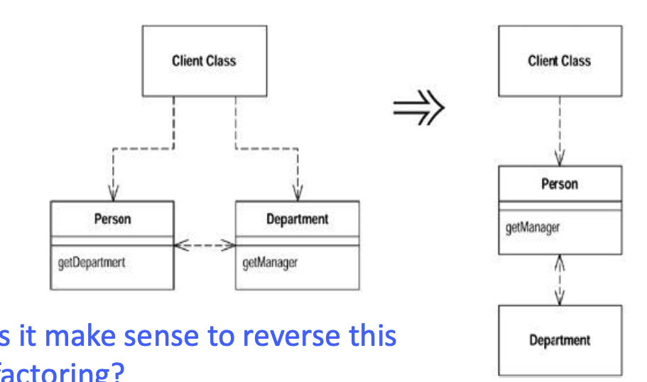

# Code quality

> Quality in software systems development, quality attributes and software metrics. Tactics for quality assurance at the level of individual quality attributes. Clean Code and SOLID principles, code refactoring. Code testing, unit tests, integration tests, user and acceptance tests. Debugging and performance testing. Quality management process in software systems development. Practical examples for all of the above. (PV260, PA017, PA103)

[PV260 prednasky](https://is.muni.cz/auth/el/fi/jaro2022/PV260/um/lectures/)

[PA017 prednasky](https://is.muni.cz/auth/el/fi/podzim2021/PA017/um/cz/)

[PA103 prednasky](https://is.muni.cz/auth/el/fi/podzim2021/PA103/um/)

## Quality in software systems development, quality attributes and software metrics

- Kvalita = schopnost produktu splnovat pozadavky
  - **Externi kvalita** (z pohledu SW) jsou zakaznicke pozadavky
    - pouzitelnost
    - prenosnost
    - spravnost
    - spolehlivost
    - bezpecnost
    - vykon
  - **Interni kvalita** je kvalita implementovaneho produktu, dulezity zaklad pro externi kvalitu
    - Duraz na dlouhodobou udrzitelnost
    - Snadna modifikace
    - modularita
    - jednoduchost
    - testovatelnost
    - prizpusobitelnost zmenam
    - citelnost kodu
    - znovupouzitelnost
    - skalovatelnost
    - dodrzovani standardu
    - spravne navrzena architektura
  - Pokud narazime na spatnou externi kvalitu, muze to byt dusledkem spatne interni kvality

## Quality attributes

- **Udrzitelnost:** Snadnost uprav bez tech debtu
- **Vykonnost:** Reakcni doba systemu a efektivita a vyuziti zdroju
- **Spolehlivost:** Pravdepodobnost bezchybneho fungovani po urcitou dobu (99.999%)
- **Testovatelnost:** Jak snadno lze system testovat, dobre udelany dependency injection? IoC?
- **Skalovatelnost:** Schopnost systemu zpracovavat vetsi mnozstvi pozadavku
- **Bezpecnost:** Odolnost vuci utokum
- **Pouzitelnost:** Snadnost pouziti a jednoduchost uceni se

## Software metrics

- Jake mame metriky?
  - LoC
  - Commented LoC
  - Pocet trid
  - Pocet funkci
  - Pocet packages
  - Pocet souboru
  - Provazanost trid
  - Hloubka dedicnosti (`A->B->C->...`)
  - Cyklomaticka slozitosti = Pocet nezavislych cest ve zkoumane jednotce (funkce/trida)
- Metriky by se nemely pouzivat k ohodnoceni vykonu vyvojare (LoC/day neni validni metrika vyvojare)
- 100% code coverage != spravne fungujici system (testy muzou byt napsany tak, aby prosly, ne aby potencialne objevily chyby)
- **Prime metriky** -> pocet defektu
- **Neprime metriky (odvozene)** -> vypocitani z primych metrik, hustota defektu, pocet defektu na velikost/slozitost
  - !!!**Dulezitejsi nez prime metriky**!!!

## Tactics for quality assurance at the level of individual quality attributes

- **Udrzitelnost:** Refaktoring!
  - samostatne jednotky,
  - separace dat od logiky (jednoduchy substitution),
  - decoupling (zavislost na rozhrani = DI)
- **Vykonnost:**
  - Caching,
  - paralelismus,
  - async komunikace,
  - detekce a mitigace bottlenecku (pouziti profileru),
  - Omezeni volani nakladnych metod (ulozeni do variable namisto 3x volani po sobe)
- **Spolehlivost:**
  - Monitoring (logovani) - events collection,
  - processing and logging,
  - spravne resolvovani exceptions,
  - fault tolerant system - redundance a self-healing nebo v momente crashe prepnuti na fail-safe system/novy service provider,
  - health check,
  - snapshoty a moznost rollbacku,
  - restart/recovery moznosti - odeslani formulare se nepovede? Vraceni se na predvyplneny formlar (+ diagnostika systemu)
- **Testovatelnost:**
  - Psat CLEAN code,
  - mitigovat global state,
  - separace interfacu od implementaci (testovani zavisi na interfaces),
  - dependencies jsou explicit (definovat requirements v constructoru)
  - Separace factories z business logiky
- **Skalovatelnost:**
  - jednodussi/mensi jednotky
  - samostatne nasazeni subsystemu
  - distribuce/replikace dat (db je tezke horizontalne skalovat (only read nodes?))
- **Bezpecnost:**
  - Static analysis security issues (sql injection, regex backtracking)
  - Detekce a oprava chyb
  - Sifrovana komunikace

## Clean Code and SOLID principles, code refactoring

- 10x cteme, 1x piseme = prace s kodem
  - Potreba mit VELMI srozumitelny, self-documented code
  - Cas developeru je drahy, levnejsi je opravovat chyby v zacatcich, nez posleze, kdyz je appka nasazena (exponencialni rust ceny bugfixu)
- Jasne pojmenovani
  - metoda zacina slovesem
  - trida podstatnym jmenem
  - zaroven je nutna KONZISTENCE, nekombinovat treba `delete()` a pote `remove()`
  - boolean metody zacinaji `has..()` nebo `is..()`
  - jednoduche a vystizne nazvy metod (hlavne u API/public)
    - interni pojmenovani konstant a promennych muze byt verbose
- Complexity metod a trid v rozumne delce

- **DRY:** Dont repeat yourself - neduplikovat kod/informace
- **KISS:** Keep it simple stupid - jednoduchost pred performance optimized systemem, neni duvod pouzivat slozite techniky na jednoduche problemy
- **YAGNI:** You aint gonna need it - Neni to treba? Nedelej to.., Neni treba delat prilisne abstrakce pro budouci funkcionalitu, je lepsi udelat vec jednoduse a pak ji upravit, nez ji delat co nejuniverzalneji

### SOLID

5 principu:

- **Single responsibility principle:**
  - Kazda trida ma pouze jednu zodpovednost = jedna classa = jeden use case
  - Diky tomu dosahneme toho, ze tvorime jednoduche bloky, mene provazane
- **Open/Closed principle:**
  - Otevreno pro rozsireni, zavreno pro modifikaci, pridavani nove funkcionality pred zmenou zdrojoveho kodu
    - Nova classa = mensi pravdepodobnost ze neco rozbijeme
- **Liskov Substitution principle:**
  - Parent trida je nahraditelna Child tridou
    - nesmime narusit chovani systemu
    - podtridy musi dodrzovat interface parentu
    - nesmi odstranovat chovani parentu
  - Dve tridy sdili podobne chovani, vyvoreni "base" a dedeni z ni
- **Interface segregation principle:**
  - Nedelat obrovske kontrakty se spousty funkcionality
  - Meli bychom vytvaret interfaces jen presne pro to, co potrebujeme, radsi kouskovat na mensi casti, nez obrovske jaderne elektrarny v jednom kontraktu
- **Dependency inversion principle:**
  - Zavislost na kontraktech, ne na implementacich
  - Snizovani provazanosti modulu
  - Pomoci konstruktoru - davame najevo, jake zavislosti potrebujeme, nevytvarime dalsi za behu (spatna testovatelnost)

### Refactoring

- Uprava kodu tak, abychom zlesili jeho interni struktury, ale zaroven nezmenili externi chovani
- Je potreba mit solidni zaklad ve forme testu, pred samotnym refactoringem
- Refactoring != pridavani nove funkcionality, soustredime se pouze na jednu vec
- Vyuzivani editoru/IDE -> pomoc se zakladnima technikama refactoringu:

  - **Extract Method:** kus kodu by potreboval komentar nebo byt vyuzit na vicero mistech
  - **Inline Method:** opak, zrusime vytvorenou metodu a usetrime zbytecne definovani chovani
  - **Remove assignments to parameters:** metoda prijima parametr, ulozime si jej do promenne a ten dale zneuzivame/transformujeme
  - **Replace method with method object:** obrovska metoda? Konverze do objektu s vlastnima parametrama (promenne metody se stanou parametry)
  - **Move method:** metoda bude pouzivana vicero tridama? Vytazeni metody do vice "general" tridy
  - **Hide delegate:** Client vola vicero "delegujicich" class -> abstrakce

- REFAKTORING KODU MUZE SNIZIT PERFORMANCE, ALE JEDNODUCHOST CTENI 100x VYKOMPENZUJE PERFORMANCE

## Code testing, unit tests, integration tests, user and acceptance tests

- Proces evaluace, zda system splnuje specifikovane pozadavky
- Odhalujeme chyby, ale nikdy si nemuzeme byt 100% jisti
- Idealne testuje osoba, ktera neni autor kodu
- **Whitebox** (strukturalni) - unit testing, integration testing, performance testing - vidime zdrojovy kod
- **Blackbox** (funkcionalni) - acceptance/system testing - sledujeme hlavne vstupy a vystupy, nevime co se deje uvnitr
- Pri narazeni na chybu je treba nejen provest opravu, ale i vytvorit test, aby se chyba neopakovala
- **Regression testing** - zmeny v systemu nesmi vyvolat pady uz definovanych testu
- **Smoke testing** - nove funkce funguji v novem prostredi?
- **Sanity testing** - podobne smoke testu, po korekci erroru v test casu spoustime sanity testing a testujeme, zda vse funguje
- **A/B testing** - vytvorime 2 (nebo vicero) varianty a sledujeme, ktera je uspesnejsi
- **Mutation testing** - lze zjistit kvalitu vytvorenych testu, upravime source code, zavedeme ucelne chybu a ocekavame failujici testy
- Obecne je treba se zamerit na rizikovejsi branches a funkcionality, nelze pokryt vse
- Vstupy testu rozdelujeme na kategorie `lower than, equals, greater than` a z nich vybereme par reprezentantu, nelze testovat kazdou hodnotu, respektive je to nakladne

### Test Coverage

- Ruzne parametry:
  - **line/statement coverage** - pokryte radky/expressions (if, loops, switch)
  - **function coverage** - pokryte metody
  - **branch coverage** - pokryte logicke celky programu
  - **condition coverage** - kazda boolean podminka byla vyhodnocena jako true i false
    - `if (a>1) {...}` vyzkousime `a=2`, ale i `a=0`
- 100% test coverage neznamena bezchybnost

### Unit tests

- Validace JEDNE izolovane jednotky (funkce/trida)
- white box
- automatizace testu
- rychle, citelne, determenisticke
- izolace `jednotky` od okolniho sveta
  - mock - predprogramovany objekt (treba vsechno jen pri callu vyhazuje exception)
  - spy - zaznamenavani volani metod, s jakyma parametrama, jaky byl return value
  - stub - nahrazuje chovani metody (simuluje return value)
  - dummy object - potreba vytvorit objekt, ktery se ale nikdy nepouzije
  - fake object - in memory db napr

### Integration tests

- Sleduje, jak jednotlive jednotky interaguji mezi sebou
- Pomalejsi, vetsi a slozitejsi
  - Nutno nainicializovat vsechny "jednotky" neboli instances trid

### System testing

- Overeni, ze system splnuje specifikovane pozadavky
- testuji pouzitelnost, kapacita, vykon, bezpecnost
- vyuziva benchmarking, penetracni testovani, uzivatelske testy
- lze automatizovat (selenium, puppeteer)
- **BLACKBOX**

### Acceptance testing

- Overeni, zda system splnuje business pozadavky a je "ready to release"
- Muzou byt predem urceny zakaznikem
- Provadeji se se zakaznikem
- **BLACKBOX**

### Test-driven development (TDD)

- RGB testing (red, green, blue)
  - **red** = vytvorime failujici test
  - **green** = implementuje funkcionalitu co nejjednoduseji
  - **blue** = refaktorujeme, aby funckionalita odpovidala standardum, aby to fajne vypadalo

### Behaviour-driven development (BDD)

- Se zakaznikem vzniknou scenare chovani systemu
- scenare slouzi vyvojarum a testerum jako jednotky

## Debugging and performance testing

- Identifikace a mitigace problemu s rychlosti, spolehlivosti, odezvy, propustnosti systemu
- Nalezame hranice systemu
- **Load testing** - sledujeme, jak system funguje pri dlouhodobe zatezi
- **Stress testing** - sledujeme kratkodobe vykyvy systemu (peak times)
- Potreba stale monitorovat system - logovani - v momente failu muzeme vyhledat error messages
- Pokud zvysime vykon, snizime tim maintainability (paralelismus je peklo a tezko se v nem developer vyzna)

## Quality management process in software systems development

- SQM (Software Quality Management) je kolekce procesu, ktere zajistuji, ze SW, jeho implementace a life cycles splnuji organizacni SW kvalitativni pozadavky
  - \+ pozadavky stakeholderu
- **Process** = ma "purpose" a "ourcome", kazdy ma minimalne jednu aktivitu
- **Activity** = konstrukt tasku, ktere spolu souvisi
- **Task** = detailni navrh implementace procesu
- **Note** = poznamky k lepsimu popsani mechanismu procesu

- Jak moc kvality je potreba? Kdybychom mohli prevest metriku kvality na procenta, kolik procent je treba? 100%?

  - In general, je potreba byt kvalitnejsi nez konkurence
  - Nehraje se na 100% kvalitni aplikaci, snazime se te kvality pouze pomalu dosahnout
    - vysoka kvalita = vysoka nakladnost

- **SQP** (Software quality planning)
  - Jake "quality standards" maji byt pouzity, definovani cilu, estimovani effortu
- **SQA** (Software quality assurance)
  - Process focused - set aktivit zajistujici kvalitu v SW procesech
  - Prevence (CI/CD, code analysis)
- **SQC** (Software quality control)
  - Product focused - set aktivit pro zajisteni kvality SW produktu
  - Identifikace defektu v releaslem produktu
- **SPI** (Software process improvement)
  - Zlepsovani procesu se zamerem zlepsovani SW kvality
