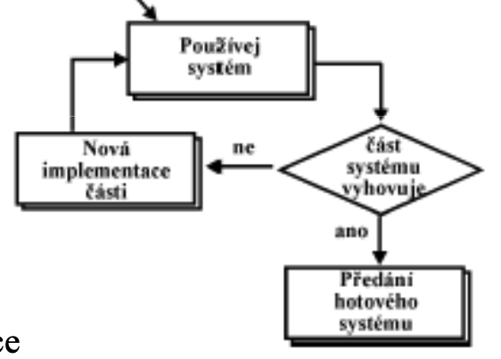
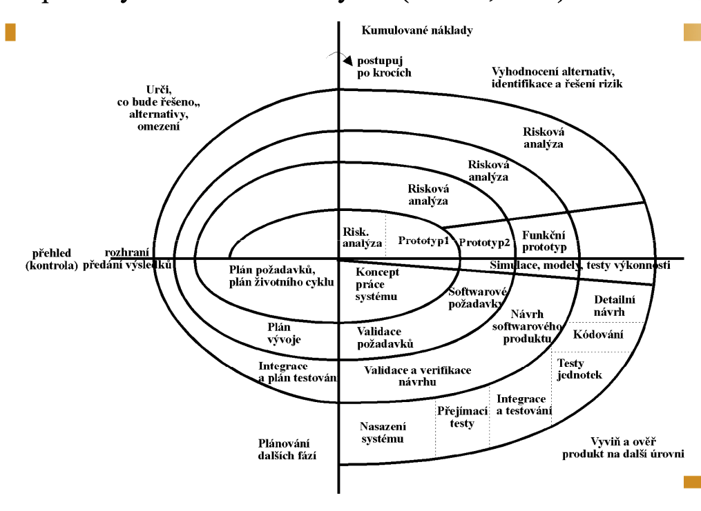

# Software engineering

> Software life cycle, software development process and software development management. (Rational) Unified Process (UP, RUP), agile methodologies and principles of agile software development. Deployment and operation of software systems. Maintenance of software systems, reusability. Practical examples for all of the above. (PA017)

[PA017 prednasky](https://is.muni.cz/auth/el/fi/podzim2021/PA017/um/cz/)

## Software life cycle

- Kazdy SW se vetsinou sklada z fazi analyzy, navrhu, implementace, testovani a provozu
- Rozdily mohou byt ve forme - jak tyto casti zakomponujeme do zivotniho cyklu
  - **Iterace?**
    - sprinty (2 weeks) - v ramci sprintu zvladneme treba 3 features
  - **Inkrementy?**
    - vezmeme jednu nebo dve features, nehlede na cas implementujeme, releasneme a bumpneme verzi (5.0 -> 5.1)

### Software development process and management

- Existuje nekolik modelu, ktere muzeme pri vyvoji pouzit
- Dulezite je nezavisle na modelu nastavit spravnou komunikaci, definovat ubiqutous language
- Pokud chceme ridit projekt, je treba mit stale aktualni informace
- **Waterfall model:**
  - Sklada se z casti:
    - Analyza
      - Sber pozadavku klienta
      - Co rika a co potrebuje jsou dve rozdilne veci - vime co opravdu potrebuje?
        - Pro predstavu muzeme analyzovat praci klienta se starym systemem
    - Navrh
      - Pozadavky SW transformujeme na navrh architektury, jednotlivych komponent, technologii, planu testovani, prototypovani, UI navrhy
    - Implementace
      - Tvorba SW na zaklade navrhu
    - Testovani
    - Provoz
  - PROS:
    - Je to velmi jednoduchy model
    - Musi jit vse hladce, pote je i nejlevnejsi
  - CONS:
    - Nic nikdy nejde hladce
    - Spatna reakce na zmeny, v implementaci zjistime spatne definovane pozadavky? RIP, musime se vracet slozite zpet
    - Zakaznik nedokaze presne rict vsechny sve potreby na zacatku
    - V praxi nejsou tyto kroky dodrzovany, spise se snazime co nejdrive zakaznikovi ukazat prototyp, ktery dale zlepsujeme
  - **V model:**
    - Jako vodopadovy
    - Ke kazde fazi existuje na druhe strane sada testu
  - **Incremental model:**
    - rozdeleni projektu na inkrementy
    - 
    - Definujeme kriticke features, seradime je podle priority
      - Vyvijime jednotlive inkrementy od nejpodstatnejsich veci
    - Po nasazeni dostaneme feedback
    - PROS:
      - Dodavani SW po castech
      - Naklady jsou rozlozeny
      - Uzivatel ma hmatatelny produkt o dost drive
      - Muzeme rychle reagovat na zmeny
    - CONS:
      - Naklady jsou nakonec o dost vetsi
      - Vyzadujeme narocne planovani a rozdeleni distribuce prace
      - Pripojovani modulu muze byt slozitejsi
  - **Spiral model:**
    - Kombinuje designovy pristup a prototypovani
    - Velmi se zameruje na analyzu rizik
    - Rozdeluje projekt na mensi segmenty
    - Kazdy cyklus spiraly spousti STEJNY sled kroku
      - Analyza
      - Vyhodnoceni
      - Vyvoj
      - Planovani
    - 
    - Na pocatku kazdeho cyklu se identifikuji podminky, na konci se provadi revize a predani
  - **Prototyping:**
    - Vytvarime prototypy systemu, abychom porozumeli, jak chce zakaznik system pouzivat
    - Po evaluaci prototypu jej zahodime a zaciname s novym prototypem/praci na realnem systemu
  - **Vyzkumnik:**
    - Experimentovani
    - Navrhni a implementuj model -> vyhovuje? good -> nevyhovuje? zpet k navrhu a implementaci

## (Rational) Unified Process (UP, RUP)

- **UP === RUP** (The Unified Process name is also used to avoid potential issues of copyright infringement since Rational Unified Process and RUP are trademarks of IBM)
- Duraz na procesy
  - Definuje **Kdo, Co, Kdy a Jak** pro splneni cile/pozadavku
- Vyhodna pro vetsi tymy/projekty/spolecnosti
- Vyhodna, pokud mame jasne definovane pozadavky
- Akceptovatelne variabilni promenne jsou cas a zdroj
- Extenzivni planovani predem
- **Iterativni** a **Inkrementalni**
- Jednotlive aktivity se prekryvaji Business modeling - Deployment
- Use case driven
- Architecture centric - tym architektu, se kterym ostatni komunikuji (centralni komunikacni uzel)
- Velmi si zaklada na **dokumentaci** (UML diagramy)
- PROS:
  - Zakaznik u vyvoje neni potreba
  - Definice zakotvena uz od zacatku (v kontraktu)
- CONS:
  - Fixni (vicemene) deadlines, rozpocet i funkcionalita
  - Zmeny jsou problem
  - Casove narocne planovani
  - Slozity kontrakt, ktery musi pokryt "akoze vela veci"
    - Akceptacni kriteria
    - Penale
- 4 Iterace:
  - **Inception** (1 iterace)
    - Definujeme scope projektu a vytvorime business cases
    - Identifikace critical risks
    - **ACTIVITY DIAGRAM**
    - -> ziskame OBJECTIVES
  - **Elaboration** (2 iterace)
    - Sber pozadavku
    - **USE CASE DIAGRAM, SEQUENCE/COLLABORATION DIAGRAM**
    - Vytvoreni architektury
    - Specifikace features
    - -> ziskame ARCHITECTURE
  - **Construction** (4 iterace)
    - Vytvoreni produktu
    - Testovani funkcionality
    - Relativne stabilni beta verze - ready to roll out
    - **CLASS, OBJECT, COMPONENT DIAGRAMS**
    - -> ziskame OPERATIONAL CAPABILITY
  - **Transition** (2 iterace)
    - Opraveni defektu
    - Vytvoreni manualu
    - Konzultace s klientem
    - Predani
    - **DEPLOYMENT DIAGRAM**
    - -> ziskame PRODUCT RELEASE

## Agile methodologies, principles of agile software development

- Flexibilni, duraz na lidi
- Snazime se fixovat cas a zdroje, promenna je funkcionalita
- Spolecne rysy vsech agilnich metodik:
  - Iterativni a inkrementalni - kratke iterace (max mesic)
  - Komunikace se zakaznikam a developery
  - Prubezne automatizovane testovani
- Vyvoj v kratkych fazich, funkcionalita dodavana po castech (prubezne sledovani a reakce na zmeny)
- Dokumentace tezko drzi tempo s realitou -> co nejjednodussi -> nejlepe generovana ze source code
- **Individualita a interakce** > procesy a nastroji
- **Fungujici SW** > obsahla dokumentace
- **Spoluprace se zakaznikem** > sjednavani smluv
- **Reakce na zmenu** > plneni planu
- Extreme programming - osvedci se nam postup? Zacneme ho vyuzivat na 120%
  - reviews good? furt reviewujeme
  - testy good? miliarda testu
  - Pair programming, duraz na testy, refactoring, kod je single source of truth
  - Rychla zpetna vazba
  - Narocne na cas (a penize?)
- FDD (Feature-driven development)
- TDD (Test-driven development)

### SCRUM

- Nejcastejsi agile metodika
- Easy to understand, difficult to master
- Iterativni a Inkrementalni
- Eventy:
  - **Sprint**
    - Iterace soustredena na vyvoj subsetu product backlogu
    - Konci "usable a potentially releasable" produktovym inkrementem
    - Pracuje cely SCRUM tym
      - PO komunikuje, developers vyvijeji, Scrum master managing procesy
    - Analyse-Design-Build-Test
    - Max 1 mesic!
  - **Sprint planning**
    - 8h meeting (wtf, mame to max na 2-3h)
    - Cely tym
    - Nastaveni cilu
      - Vybirani z product backlogu a assignovani tasku
  - **Daily SCRUM**
    - 15m meeting
    - Developers a SCRUM master (ale muze se pridat kdokoliv, kdo chce mit prehled o tom, co se prave deje)
    - Jednoduse a vystizne **CO JSEM DELAL VCERA**, pak **CO BUDU DELAT DNES** a nakonec **MAM NEJAKE PREKAZKY**?
  - **Sprint review**
    - 4h meeting (to sedi i v Adacte)
    - Cely tym a stakeholders
    - Zhodnotit inkrement
    - Zkontrolovat backlog
    - Probere se progress, co je v procesu dal, uprava priorit/completion date
  - **Retrospective**
    - 3h meeting
    - Cely tym
    - Resi se:
      - Procesy
      - Komunikace/Vztahy
      - Nastroje
    - Co se nam povedlo, co naopak ne, v cem muzeme byt priste lepsi
    - Vytvori se action items za ucelem zlepseni dalsiho procesu prace
      - \+ Evaluace minulych action items
- Role:
  - **Product owner**
    - Reprezentuje stakeholders
    - Spravuje product backlog
    - -> KOMUNIKACE
  - **SCRUM master**
    - Focus na procesy
    - Odstranuje prekazky
    - -> MANAGEMENT SCRUM PROCESU
  - **Developers**
    - 3-9 developeru
    - mixle v pixle (frontent/backend/db/analytici/testeri/designeri)
    - samo-organizujici se tym
    - -> DELIVER PRODUCT
- Artefakty:
  - **Product backlog**
    - Scope produktu
    - Nezavisle funkce ve forme "**user stories**"
    - Vsichni ve SCRUMu tvori backlog
    - PO je zodpovedny
    - JIRA/fyzicky board s listeckama (pravek jak cyp nebo na mini projektiky)
    - Kazdy task (user story) ma sve story pointy
      - story pointy estimuji "amount of work"
      - casto se vyuzivaji alternace fibonacciho posloupnousti
  - **Sprint backlog**
    - Vypickovane itemy z product backlogu (subset)
    - Plan, ktery se splni (hopefully) ve sprintu
    - Developeri jsou zodpovedni za sprint backlog
    - Prioritizace itemu
    - Definice "Done" Co to znamena? -> Implementovano? Otestovano? Releasnuto?
    - Priorita se zmenit muze, odebirani nebo dalsi pridavani tasku je zakazano
  - **Product increment**
    - Vsechny splnene itemy ze sprint backlogu (itemy z product backlogu splnene ve sprintu)
    - Vytvoren developery
    - Testovany zakaznikem
    - Released by PO
- Zakonceni SCRUMu:
  - V Product backlogu nic neni
  - Posledni inkrement je dostacujici (defekty jsou prijatelne)
  - Dosly prachy nebo cas
  - PO nebo stakeholder shut downne projekt
- Kontrakt ve SCRUMu:
  - PROS:
    - flexibilni
    - scope neni jasny predem, muzeme jednoduse pridavat "features" a reagovat na zmeny
    - Casta kontrola zakaznikem - budovani duvery
  - CONS:
    - Zapojovani zakaznika bere cas
    - Tezko predikujeme budget a deadline

## Deployment and operation of software systems

- Dulezite mit plne otestovany produkt pred nasazenim do produkce
- Monitoring systemu - logovani udalosti
- Priprava prostredi (os, db), lze automatizovat PaaS nebo dockerizace (izolovane containery)
  - mitigace "it works on my machine"
- Nutnost projit dokumentaci - je "up to date"?
- Skoleni uzivatelu
- Konfigurace systemu pro ucely zakaznika
  - viz implementace AdInsure pro Generali...

## Maintanance of software systems, reusability

- Udrzba muze byt samostatny projekt
- Muze byt maintainovana jinym tymem - predani produktu
- Oprava bugu, aktualizace a vylepseni (soucasti by mel bych changelog)
- Znovupouzitelnosti je mysleno prepouziti service/celeho SW
  - prepouziti internich struktur je vicemene no-go (pokud to neni jen library)
