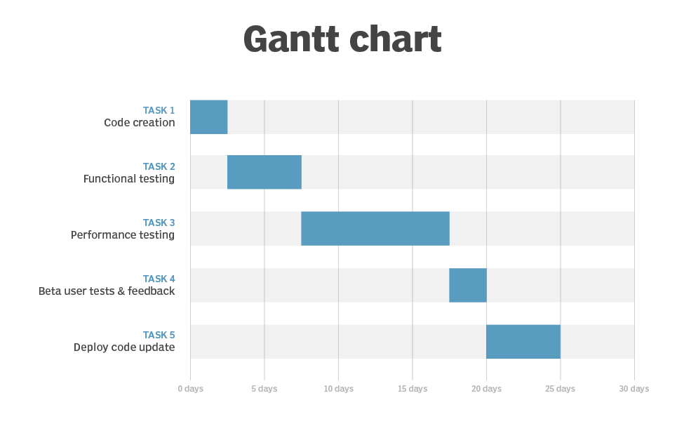
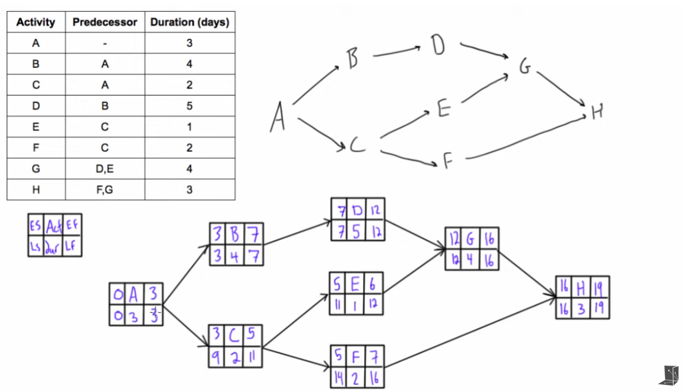
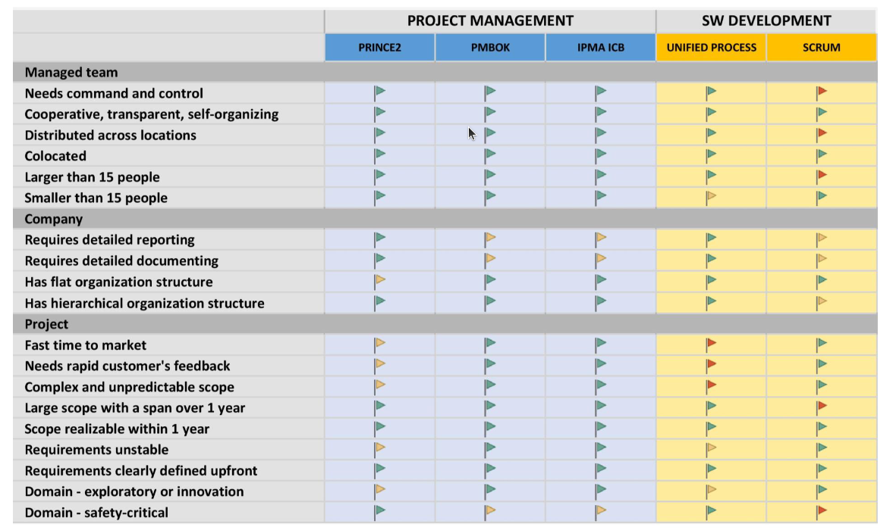
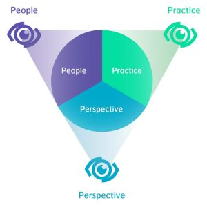

# Project Management

> Planning, risk management, role of models in project management. Gantt charts, network analysis, critical path method (CPM), Program Evaluation and Review Technique (PERT). International standards and methodologies for project management (PMI Project Management Body of Knowledge, PRINCE 2). Practical examples for all of the above. (PA179)

[PA179 prednasky](https://is.muni.cz/auth/el/fi/jaro2022/PA179/um/)

## Planning

- 3 urovne planovani:
  - **Project:**
    - docasny
    - start i konec
    - priprava, provedeni, uzavreni (nebo proste SW cyklus)
    - je unikatni - neni to kazdodenni rutina
    - planovane
    - opakovatelne prvky projektu = procesy (vizualizovane treba flow chartem)
      - _PROCES JE OPAKOVATELNA SERIE AKTIVIT S DEFINOVANYMI VSTUPY, VYSTUPY, NASTROJI A TECHNIKAMI_
    - Maji rizika - nikdy to nikdo nedelal, mame deadlines, musime provest zmenu
    - **Management**:
      - balanc casu, ceny a rozsahu
      - potreba vybrat PM standard (PRINCE2, PMBOK, IPMA) pro lepsi komunikaci, koordinaci, duveru stakeholderu, transparentnost, not inventing the wheel
  - **Program:**
    - skupina docasnych vzajmne propojenych projektu
      - rizene jako celek
    - sprava rizik
    - v projektech se premysli a planuje s ohledem na jine propojene projekty
  - **Portfolio:**
    - skupina projektu a programu
    - snazime se dosahnout dlouhodobych strategickych cilu
    - neboli = co muzeme nabidnout?
    - **Management:**
      - monitoring vykonu firmy
      - vyber a prioritizace programu a projektu
- Novy projekt -> vyber optimalniho pristupu = prediktivni/agilni
  - spatne vybrany pristup muze razantne zvysit sanci na **failure**

### Agile planning

- sepsat Project charter
  - zakladni informace o projektu
  - proc, co, kdo, kdy, jak, za kolik, ...
- sepsat podrobnosti klicovych strategii
  - komunikace, rizika, kvalita, zmeny
- zacit planovat praci
  - product backlog, reseni architektury

### Predictive planning

- Prvne se sepisuje **PID (Project Initiation Documentation)**
  - detailni business case
  - vse o projektu (proc, co, kdy, jak, za kolik, ...)
  - klicove strategie (komunikace, rizika, kvalita, zmeny)
  - vsechno se **INTENZIVNE DOKUMENTUJE**
  - vse se schvaluje product boardem (executive, engineers, users)
  - pote se zapisuji i zmeny a prubeh (porovnani planu a reality)
- Pote se dela detailni analyza pozadavku
  - use case diagramy
  - detailni rozsah pro oceneni a design mockupy
  - tvorime **Specifikacni dokument**
    - pozadavky
    - system breakdown (jednotlive komponenty)
      - detailni popis
    - ocekavana kvalita
    - acceptance criteria
- Potom prichazi **projektovy plan**
  - proc, co, kdo, kdy, jak, za kolik, ...
  - **WBS (Work Breakdown Structure)**
    - tvorime ze specifikacniho dokumentu
    - pocitame cas a cenu jednotlivych work packages
      - treba pomoci PERT
    - tvorime zavislosti
  - tvorime rozvrh (Gantt/Network diagram -> CPM?)
  - prirazujeme odpovednosti

## Risk management

Postup:

1. Identifikace rizik:
   - predchozi zkusenosti
   - lessons learned
   - co a proc se dojebalo
2. Ohodnoceni rizik:
   - zpusobeni nakladu
   - odhad ceny
   - **PRAVDEPODOBNOST** a **IMPAKT**
3. Urceni odezvy:
   - accept - akceptovatelne, nechame byt, zbytecne plytvani zdroju
   - mitigate - nastaveni planu, aby se tomu nestalo (jina technologie/knihovna/nebo si to napiseme sami)
   - transfer - outsorcing, pojisteni, potreba mit solidne nastavene SLA
   - reduce - snizime pravdepodobnost/impakt (lepsi reviews?)
4. Stanoveni monitoringu:
   - odpovednost za monitoring
   - kde definujeme rizika, v jake periode je budeme refreshovat a editovat
5. Vytvoreni registru rizik:
   - self-explanatory

### Zdroje rizik

- user
- requirements
- project complexity
- management
- team
- company
- 3rd party

### Prevence rizik

- transparence a feedback
- definovani user stories - snadno pochopitelna a uchopitelna zakaznikem (maji sve acceptance criteria)
- Definition of "Done"
- kratka iterace = brzky feedback = brzo zjistime, co je na hovno

## Role of models in project management

- sitova analyza
- CPM - metody kriticke cesty
- modelovani procesu, komunikace, financi, rizik

## Gantt charts

- Nastroj pro planovani projektu
- 
- lze rozsirit
  - PDM - omezeni, precedencni podminkys
  - milestones
  - progress
  - zdroje (kdo)
- Y = ukoly
- X = cas

## Network analysis

- metoda pro modelovani souboru cinnosti vedoucich k dosazeni cile (projektu treba)
- cilem je projekt naplanovat, minimalizovat prostoje a naklady
- urcit terminy
  - celkova doba trvani projektu
- identifikovat kriticke ulohy v projektu
- pouziti sitoveho grafu
  - hrany/uzly
- uzlove orientovany = easy modelovani precedencnich podminek
  - pro metodu CPM

## Critical path method (CPM)

- metoda pro identifikaci vzajemnych zavislych aktivit
  - pro ty, ktere maji vliv (jsou kriticke) na dobu dokonceni celeho projektu
  - nemuzeme je opozdit bez prodlouzeni celkoveho dokonceni projektu
- 
- graf zavislosti
  - aktivita
  - predchudce
  - duration
- prvni pruchod = start => konec (**EARLIEST**)
  - dva vedou do dalsiho = **vezmeme maximum**
- druhy pruchod = konec => start (**LATEST**)
  - dva vedou do dalsiho = **vezmeme minimum**
- zjistime kritickou cestu
  - ty aktivity, kdy je konec earliest a latest **stejny**
- **slack/float**
  - o kolik muzeme aktivitu opozdit? `(latest completion) - (earliest completion)`

## Program evaluation and review technique (PERT)

- technika odhadu dokonceni tasku
- optimisticky, pesimisticky a nejpravdepodobnejsi odhad
- `expected = (optimistic + 4*(most likely) + pesimistic) / 6`
- muzeme se dopocitat i k odhadovane cene

## International standards and methodologies for project management

- standardy pro projektove rizeni
  - PRINCE2
  - PMBOK
  - IPMA ICB
- pro popis obecneho zpusobu rizeni
- pro SW vyvoj je to potom RUP a SCRUM

### PRINCE 2 - PRojects IN Controlled Environments 2nd Version

- rizeni obecneho projektu
- step by step (spousta byrokracie)
- neni soucasti:
  - sprava pozadavku
  - rozpoctovani
- pro koho?
  - velke reportovani
  - detailni dokumentace
  - tym s radem a kontrolou
  - manazer s little experience
- PHASES:
  - **Starting up**
    - Project brief
      - feasibility
        - klicove pozadavky, rizika
      - dopady na architekturu v pripade pozadavku
      - identifikace actoru
      - identifikace 3rd pary komponent
      - zjistime cile a mock architektury
      - analyza existujicich reseni
      - urceni technologii
      - orientacni cena, casovy plan a rizika
    - Potom v dalsi fazi:
      - Work Breakdown Structure
      - identifikace aktivit
      - dependencies
      - odhad trvani
      - milestones
      - define roles a zodpovednosti
      - tvorba rozvrhu (Gantt/sitovy diagram)
  - **Initiation**
    - PID - Project Initiation Documentation
      - proc, co, kdy, jak, za kolik
      - definice projektu/scope/kontext
      - schvaluje product board
      - detailni business case
      - popis managementu, roli
      - popis pristupu ke kvalite, zmenam, riziku, komunikaci
      - plan projektu
    - plan dalsi faze
  - **Delivery**
    - vice iteraci
    - iterace = max 3 mesice
      - meritelne a overitelne milestones
    - product manager:
      - udrzeni ceny, terminu, rozsahu a kvality podle PID
      - autorizuje, provadi reviews work packages, reportuje status, zmeny, problemy, spravuje rizika a problemy
    - tymovy manager:
      - tymove planovani (pro work packages)
      - demonstruje kvalitu produktu
      - zajistuje dodavani work packages
    - mezi fazemi se hodnoti koncici faze a planuje (WBS, Gantt, aktualizace PIDu)
  - **Close**
    - vytvorit SLA
    - predani OPS/maintanance tymu
    - predani, nasazeni, uzavreni docs/PID
    - end report
    - lessons learned
- 7 principu
  - proc to delame
  - uceni se ze zkusenosti (co byl fuckup)
  - role a odpovednosti - presne definovana struktura tymu/prava/odpovednosti
  - rizeni po fazich - po kazde fazi review, reporting vyssimu managementu
  - Manage by exception - co funguje necham tak, co nefunguje dale ridim
  - Duraz na produkt - primarni je produkt, ne ze vsichni pracuji
  - Prizbusobeni metodiky - neni treba vse implementovat z PRINCE2 doslovne, ne vse je relevantni
- 7 temat
  - Business case - ocekavane prinosy, rizika, casovy/cenovy rozsah, duvody projektu
    - neustale aktualizovan
  - Organizace
    - definice roli
    - typy stakeholderu (dodavatel, zakaznik, uzivatel)
    - 3 urovne managementu
      - project board
      - project manager
      - team manager
  - Kvalita
    - monitoring
    - akceptacni kriteria
    - strategie rizeni kvality
    - resime kvalitu produktu i manazeru (plany, reporty)
  - Plany
    - Gantt
    - WBS
  - Rizika
    - identifikace
    - reakce
    - pravdepodovnost a impakt
    - registr rizik
  - Zmeny
    - priorita
    - dopad
    - kriticnost
    - moznost reseni
    - dle zmeny upravujeme zaznamy a plany
  - Postup projektu
    - porovnavame realitu s planem
    - zda stale splnujeme business case
- 7 procesu
  - Uplny zacatek projektu
    - nastineni business case
    - prirazeni klicovych osob
    - studovani lessons learned
    - autorizace od boardu
  - Inicializace
    - priprava strategii rizeni (rizik, kvality, komunikace)
    - projektovy plan
    - zalozeni dokumentace
  - Rizeni faze
    - resi produktovy manazer
    - monitoring
    - reporting
    - ridime exceptions
  - Rizeni dodani produktu
    - to same co rizeni fze, ale by team manager
  - Smerovani projektu
    - vyssi vedeni a jejich rozhodovani
  - Rizeni mezi fazemi
    - plan nadchazejici faze
    - product manager
    - aktualizace business case
    - report predchozi faze
  - Uzavreni projektu
    - project manager
    - evaluace
    - predani

### PMI (PMBOK) - Project Management Body of Knowledge

- **procesne orientovany standard**
- good practices
- handbook
- pro koho?
  - manazer, ktery potrebuje tips&tricks
    - musi ale trochu tusit, co a jak (trochu skilled)
- **49 procesu**
  - 5 procesnich skupin
    - inicializace, planovani, provedeni, monitoring a rizeni, uzavirani
  - 10 vedomostnich oblasti
    - Integrace
      - **PROJECT CHART**
        - Business case (proc) - cile, hruba cena, rozpocet, rizika
        - Project outcome (co) - popis, hlavni cile, pozadavky
        - Stakeholders (kdo) - externi i interni, role, potreby, zapojeni, odpovednosti
        - Management approach (jak) - pouzite standardy, nastroje, metodiky, zivotni cykly projektu
        - Schedule (kdy) - plan projektu, milestones, faze, gantt
    - Rozsah - pozadavky, definice, WBS
    - Plan - poradi aktivit
    - Cena - odhady pomoci WBS
    - Kvalita - rizeni a kontrola kvality
    - Zdroje - odhad nepeneznich a lidskych zdroju, ziskavani, rizeni, tvorba a sprava tymu
    - Komunikace - plan, sprava a kontrola komunikace
    - Riziko - identifikace, pravdepodovnost/impakt, analyza rizik, monitoring, procesy reagujici na rizika
    - Dodavatele - produkty/sluzby mimo nas tym, kontrakty, objednavky, SLA, vyberka
    - Stakeholders - zucastnene osoby, jejich identifikace, zapojeni stakeholderu do projektu

### IPMA ICB

- obecny standard pro vedeni projektu
- podrobna sekce o **soft skills**
- pro koho?
  - projekt dependent na soft-skills (komunikace, leadership, reseni konfliktu)
  - manazer je skilled AF, zna procesy
  - neni nutne tolik reportovat
- handbook - pro ruzne manazerske kompetence
- popisuje pozadovane dovednosti, schopnosti
  - kompetence = aplikace znalosti
  - dovednost = skill, schopnost aplikovat znalost
  - schopnost = abilty, pouziti dovednosti efektivne

- **kompetence perspektivy** = metody a techniky pro interakci jedincu s prostredim
- **kompetence lidska** = techniky pro jednani s jedinci/skupiny
- **kompetence prakticka** = metody a techniky pro uspech projektu

## Glossary

### ITIL - Service Transition and Service Operation

- best practices pro rizeni it sluzeb
- faze
  - **Service strategy** = pozadavky, zajisteni cile, finance, co vlastne delame
  - **Service design** = SLA, reseni rizik
  - **Service transition** = deployment, ulozeni ziskanych zkusenosti pro budouci projekty "lessons learned"
  - **Service operation** = dokumentace, reseni incidentu, reseni pristupu k systemu
  - **Continual service improvement** = monitoring, logging, aktualizace systemu

### SLA - Service-level agreement

- Kontrakt mezi dodavatelem a zakaznikem
  - kvalita
  - dostupnost
  - odpovednosti
