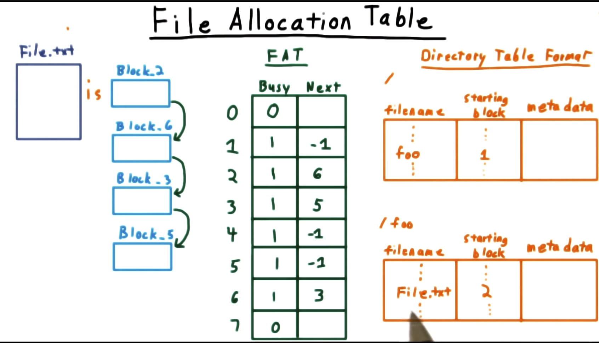
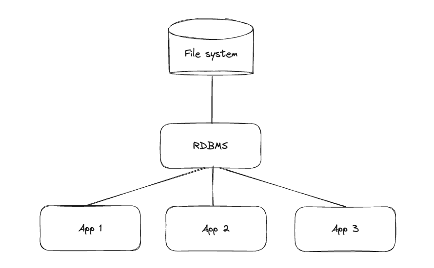

# Databases

> Principles of data storage, databases and file systems. Data encoding and compression. Architecture of relational databases, SQL query language and its parts (definitions, manipulation, transactions). Data schema definition language, DDL. Data manipulation language, DML. Relational algebra, integrity constraints, transaction control. Indexing, hashing. Practical examples for all of the above. (PV003 || PV062)

[PV003 prednasky](https://is.muni.cz/auth/el/fi/jaro2022/PV003/um/)

## Principles of data storage

### File system

- jednoduchy
- mensi systemove naroky
- heterogenni prostredi
- narocnejsi sprava pristupu
- horsi citelnost
- hodi se pro ukladani vetsich dat - treba obrazky, videa, staticke stranky
  - neprakticke uchovavat v databazi
- fragmentace dat
- obtizne zavedeni transakcniho pristupu
- **Souborovy system (FS = File System)**
  - na externi pametu
  - soucasti OS
  - **Basic File System**
    - cteni a zapis fyzickych stranek z disku
  - **Logicky Souborovy System**
    - sprava metadat
  - **Soubor (File)**
    - logicka pametova jednotka
    - kolekce souvisejicich informaci
    - **Vytvoreni**
      - aplikacni proces zavola logicky FS
      - zada parametry pro vytvoreni File
      - Logicky FS vytvori FCB (File Control Block)
      - Na disku opravi adresar
      - FCB ulozi na disk
- **Typy souborovych systemu:**
  - **FAT = File Allocation Table**
    - File je linked list of blocks
      - posledni cast bloku udrzuje id dalsiho bloku (linkovani)
    - FAT table spojuje bloky
      - obsahuje pointery na bloky vsech souboru v souborovem systemu
      - specialni pointer `-1` indikuje konec linked listu
    - Directory Table Format
      - filename/starting block/metadata (permissions)
        - filename muze byt adresar
    - 
  - **NFTS New technology file system**
    - Windows file system
    - 16 exabytes per file (proste strasne moc)
    - podporuje permissions and encryption
    - logovani, zurnal o operacich
    - komprimovani adresaru a souboru
    - **NTFS Svazek:**
      - V diskove oblasti - Partition
      - **MFT** - master file table = obsahuje vsechny metadata, informace o svazku, adresare, seznam volne pameti, logy pro obnovu
- **Directories:**
  - Linearni seznam souboru s pointery na bloky dat (FCB)

### Database

- Relacni systemy koreluji s ERD (Entity Relation Diagram)
- Umoznuji ACID (Atomicity, Consistency, Isolation, Durability)

PROS:

- Aplikacni nezavislost, jednotne rozhrani pro vsechny
- Snadne zabezpeceni konzistence dat
- konkurentni operace
- Snadna citelnost, dokumentovatelnost datoveho modelu
- Deklaracni pristup k datum (rikam **CO CHCI**, ne **JAK TO CHCI**)

CONS:

- Obtizna implementace nestandardnich pristupovych technik
- Obtizna implementace slozitych datovych struktur

## Data encoding and compression

- Techniky k transformaci informaci do formatu, ktere jsou efektivnejsi pro prenos/ukladani
- Muzeme eliminovat redundanci dat
- **Komprese:**
  - identifikace a eliminace redundance
  - **Bezztratova komprese**
    - jsme schopni plne rekonstruovat puvodni data
      - texty, zip, png
  - **Ztratova komprese**
    - cast komprimovanych dat je ztracena
    - za ucelem vetsi komprese
    - ztrata nam ve vetsine pripadu nevadi, tezko ji zpozorujem
      - jpeg, mp3, wma
- **Algoritmy Komprese**
  - Komprese
    - algoritmicka slozitost
    - pametova slozitost
    - kompresni pomer
    - mira ztratovosti
  - Dekomprese
    - rekonstrukce originalnich dat
- **Faze Komprese**
  - Modelovani
    - hledani redundance
  - Kodovani
    - generovani komprimovanych dat
- **Metody Komprese**
  - **Statisticke** - caste vzorky = kratsi kodovani slova
    - Asymetricke, jednopruchodove
    - Huffmanovo kodovani
      - tvorba binarniho stromu s usporadanym seznamem vstupu (podle cetnosti)
      - prirazeni bitove reprezentace jednotlivym vstupum
    - Shannon-Fanovo kodovani
  - **Slovnikove** - vyhledavani shodnych, opakujicich se retezcu -> prideleny kody, ktere se pak ukladaji na vystup
    - Vytvoreni slovniku (visit every string in text)
    - prirazeni hodnoty kazdemu slovu
    - nahrazeni slova novou hodnotou
    - vystup je transformovany vstup podle slovniku + slovnik samotny

## Architecture of relational databases



- Databazovy server
  - prijima, zpracovava a odpovida na pozadavky
- **Relacni databazovy system (RDBMS)**
  - autentizace, autorizace
  - pracuje nad samotnou DB
  - umoznuje definici a manipulaci s daty
  - zajistuje integritu dat
  - vyhodnocuje a zpracovava SQL queries, provadi optimalizace
  - muze cachovat
- Databaze
  - samotne misto ulozeni dat

### Database normalization

- Structuring the database to remove the redundant information
- Lehci na pochopeni
- Lepe extendovatelne
- Ochrana proti INSERT/UPDATE/DELETE anomaliim
- **1NF:**
  - nesmime mixovat data types ve stejnem sloupci
  - musime mit definovany primary key tabulky
  - serazeni zaznamu nesmi mit zadny vyznam
  - nesmime mit "repeating groups"
    - user inventory -> `jdog | weapons | 1 | shields | 2 | coins | 32`
- **2NF:**
  - Kazdy neklicovy atribut musi byt primo zavisly na celem primarnim klici
- **3NF:**
  - Kazdy neklicovy atribut musi zaviset na klici a na nicem jinem
- **BCNF (Boyce-Codd Normal Form):**
  - Kazdy neklicovy atribut musi zaviset na klici a na nicem jinem

## SQL query language and its parts (definitions, manipulation, transactions)

- Vychazi z relacni algebry
- Obsahuje kostrukty pro **definici** datoveho schemate, **manipulaci** s daty a pro **transakcni** zpracovani
- Nektere systemy maji prostredky pro proceduralni programovani (PL/SQL)
- SQL muze obsahovat triggery - akce, vykonavajici se po prikazich (INSERT/UPDATE/DELETE)
  - pouziti treba pro udrzovani history table (zurnal)
- Pri praci s SQL na aplikacni vrstve pouzivame **prepared statements**, abychom zabranili **SQL injection**

### DDL - Data schema definition language

#### Tvorba tabulek

```sql
/* block comment */
-- inline comment
CREATE TABLE User (
    id  INT PRIMARY KEY, -- zajisteni generovani/inkrementaci unikatniho id (sequence)
    name VARCHAR NOT NULL,
    rodne_cislo INT UNIQUE NOT NULL,
    description TEXT,
    created_by INT NOT NULL REFERENCES User(id),
    updated_at DATETIME
)
```

- **Generovani primarnich klicu**
  - v praxi vzdy vyhodnejsi, nez ukladani externi unikatni hodnoty (nemusi byt vzdy unikatni)
  - lepsi pouzivat cisla nez stringy
    - rychlejsi porovnavani, rychlejsi indexace
  - **Compound primary key** je mozny (vice nez jedna domena/sloupec je bran jako primarni klic) -> pomalejsi
  - vyuziti `SERIAL` nebo `AUTOINCREMENT`, pokud to system podporuje
    - jinak je treba vyuzit `CREATE SEQUENCE ...`
- **Cizi klice**
  - `created_by INT NOT NULL -->REFERENCES<-- User(id)`
  - muzeme specifikovat `ON DELETE` `CASCADE`
    - se smazanim se smazou i zaznamy napojene na parent tabulku

#### Modifikace tabulek

```sql
ALTER TABLE User ADD age INT;
ALTER TABLE User DROP COLUMN description;
DROP TABLE User;
```

- Podminena modifikace tabulek:
  - `IF EXISTS`/`IF NOT EXISTS`
    - Aby nam definice schematu napadala pri opakovane exekuci prikazu

### DML - Data manipulation language

#### Insert

```sql
INSERT INTO User(id, name) VALUES (value1, value2);
```

- kontroluje se integritni omezeni
- obvykle vraci vygenerovana data

#### Update

```sql
UPDATE User
SET name = value1
WHERE id = value2;
```

- bez `WHERE` se updatuje vse
- kontrola integritnich omezeni

#### Delete

```sql
DELETE FROM User WHERE id = value1;
```

- bez `WHERE` muze smazat vse

#### Select

```sql
SELECT DISTINCT Tabulka.sloupec, B.sloupec FROM Tabulka
JOIN TabulkaB AS B ON Tabulka.cizi_id = B.id
WHERE price > 0
ORDER BY sloupec ASC
```

- `JOIN` muze byt prepsany - pridani tabulky do `FROM` a definici podminky ve `WHERE`
- Stejna struktura dvou tabulek?
  - muzeme vyuzit mnozinove operace `UNION`, `INTERSECT`, `MINUS`
- `WHERE` muze kontrolovat podminku v mnozine hodnot - `IN`/`BETWEEN`
  - nebo logicke operatory `AND`/`OR`
  - u stringu `LIKE` (priblizne)
    - `?` zastupuje jeden znak
    - `%` nekolik znaku

#### Agregacni funkce

- `GROUP BY` sloupec/vice sloupcu
- muzeme i bez `GROUP BY`, ale pote agregacni funkce pocitaji z vysledku `SELECT`u
  - `COUNT`/`AVG`/`SUM`/`MIN`/`MAX`
- pouziti `HAVING` = `WHERE` nad agregovanyma datama

#### View

- Ulozeny a pojmenovany `SELECT`
- vykona se provedenim dotazu
- omezena modifikace dat
  - nelze modifikovat, pokud obsahuje agregaci
  - obtizna modifikace, pokud ma `VIEW` vicero tabulek -> `FROM t1, t2`

#### Materialized View

- `VIEW` s tim rozdilem, ze je vysledek predpocitany (nevykonava se pri dotazu)
- Je potreba hodnoty udrzovat aktualizovane
  - vyssi rezie na write
  - rychly read

## Relational algebra

- Relacni model je DB model zalozeny na predikatove logice
- Data jsou reprezentovana jako matematicke **n-arni relace**
- Operace nad daty pomoci relacni algebry
- Databaze organizovany pomoci relacniho modelu se nazyvaji relacni databaze
- Databaze sestava z nekolika relaci (tabulek)
- **Univerzum** = mnozina relaci popisujici "nasi oblast zajmu"
- **Relace** = podmnozina kartezskeho soucinu domen
  - **Atribut** = charakteristika objektu (neboli entity), atribut je popsan hodnotou
  - **Domena** = neprazdna mnozina hodnot datoveho typu atributu
- Pokud ruzne relace obsahuji stejne **Atributy**, vytvarime **vazby** mezi relacemi
- Relacni algebra sestava z nekolika operaci pouzivanych nad DB:
  - **Mnozinove operace** - ve vetsine pripadu je treba mit stejnou hlavicku relaci
  - **Projekce** - vyber sloupcu
  - **Selekce** - vyber radku/zaznamu
  - **Prejmenovani** - `AS nova_tabluka`
  - **Spojeni/Soucin relaci** - `JOIN`
  - **Seskupeni/Agregace** - `GROUP BY` + agregacni funkce
- Existuji dotazy, ktere nemuzeme vyjadrit relacni algebrou -> **TRANZITIVNI UZAVER**
  - Prvky v relaci = `a`, `b`, `c`: Pokud je `a` v relaci s `b` a zaroven je `b` v relaci s `c`, potom plati, ze `a` je v relaci s `c`
  - **V lidske reci**: Pokud mame tri mista, a z mista `a` se dostanu do mista `b` a z mista `b` se dostanu do mista `c`, pak musi existovat zkratka z mista `a` primo do mista `c`

## Integrity contraints

- Soucasti DDL jazyka existuji zpusoby jak omezit hodnoty, ktere mohou jednotlive domeny nabyvat
- jsou to **PRAVIDLA PRO KONZISTENCI DAT**
- `NOT NULL`, `UNIQUE`
- `FOREIGN KEY (PersonID) REFERENCES Persons(PersonID)`
- `CHECK(age>18)`
- Definice pri vytvareni tabulky nebo potom jako samostatny vyraz
- `CREATE TABLE Users (...)`
- `ALTER TABLE .. ADD CONSTRAINT .. NOT NULL (id)`

## Transaction control

- Posloupnost DML dotazu, ktere prevedou datove schema z jednoho konzistentniho stavu do konzistentniho stavu druheho
- **ACID**
  - **A** - Atomic - budto se provede vse nebo nic
  - **C** - Consistency - na konci neni poruseno zadne integritni omezeni
  - **I** - Isolation - transakce je izolovana od ostatnich transakci
    - lze nastavit zpusob chovani pri modifikaci stejnych objektu (vyhodi chybu nebo ceka)
    - lze vyuzit zamykaci mechanismy (locking)
  - **D** - Durability - po vykonani transakce jsou data persistentne ulozena
- `COMMIT` - potvrzeni zmen DML od pocatku transakce
- `ROLLBACK <TO savepoint>` - odvola zmeny od pocatku transakce nebo po savepoint
- `SAVEPOINT` - stanovi checkpoint transakce pro rollback
- `SET TRANSACTION READ WRITE` - default nastaveni transakci (povoluje vse)
- `SET TRANSACTION READ ONLY` - zakazuje transakci `INSERT`/`UPDATE`/`DELETE`

### Isolation levels

- `SET TRANSACTION ISOLATION LEVEL SERIALIZABLE` - transakce meni objekt, ktery je menen jinou konkurentni transakci? -> ukonceni chybou
- `SET TRANSACTION ISOLATION LEVEL READ COMMITED` - transakce potrebuje uzamknout objekt, ale ten je konkurentne vyuzivan jinou transakci? -> ceka na uvolneni a pak vykona

## Indexing

- Indexovani slouzi ke zrychleni/zefektivneni castych dotazu nad tabulkou
- dotazy obsahujici indexovany sloupec budou (mozna) rychlejsi

```sql
CREATE INDEX index_name ON Users (age);
```

- snazime se redukovat prohledavany prostor
- **Implementace:**
  - primarni soubor = data zaznamy
  - sekundarni soubor = samotny index (mel by byt mensi velikostne nez primarni soubor)
- **Techniky indexovani:**

  - Tradicni indexy = jako knizky, takze odkazy na radky s danou hodnotou
  - Hashing indexy = **O(1) casova slozitost** - primy pristup podle hashe k hodnote
  - B+ stromy = **O(log(n)) casova slozitost** - uzel obsahuje odkazy na uzly nize, nebo hodnoty (leafs)

    - hodnoty jsou usporadany (vzestupne)
    - [Fireship in 100 seconds](https://www.youtube.com/watch?v=MFhxShGxHWc&ab_channel=Fireship)

  - R stromy = podobne jako B+, jsou vicedimenzionalni 2D (obdelniky)
    - data v listovych uzlech
    - rodic uzlu zahrnuje vsechny sve potomky
      - idealni je, aby rodicovsky obdelnik zabiral co nejmene prostoru (redukuje tim nutnou oblast potrebnou k prohledani)

- **Typy indexu:**
  - **husty index** - existuje indexovany zaznam pro kazdou hodnotu vyhledavaciho klice
  - **ridky index** - indexovany zaznam existuje pro vybrane hodnoty vyhledavaciho klice (mnozina hodnot klice)
    - **A.K.A.** pouze pro nektere hodnoty vyhledavaciho klice, po nalezeni indexoveho zaznamu je treba projit soubor sekvencne

## Hashing

- **Cilem HASHOVANI je prevest libovolny vstup dat na vystup jednotne delky - hash**
- Hash by mel byt:
  - **jednosmerny** - nelze odvodit vstup
  - **deterministicky** - jeden vstup nemuze mit dva rozdilne hashe
  - **bezkolizni** - dva ruzne vstupy nesmi mit stejny hash
- Prolamovani hashe napriklad pomoci slovnikove metody
  - Zname pro vstupy jejich hashe a zkousime
- **Pouziti hashe:**
  - zajisteni integrity dat (certifikaty, checksum)
  - rychle porovnani dat
- **Bezkoliznost:**
  - **slaba** - pro vstup A nejsme schopni v rozumnem case nalezt rozdilny vstup B, ktery by mel stejny hash
    - **A.K.A.** A mame set in stone a hledame B takove, ze `h(A) = h(B)`
  - **silna** - nejsme schopni v rozumnem case najit **libovolne** dva rozdilne vstupy se stejnym hashem
    - **A.K.A.** hledame libovolne (A,B), kdy `h(A) = h(B)`

```text
m = h(k)
```

- **m** = adresa lokality klice
- **h** = generator rovnomerne rozlozenych hodnot
- **k** = klic

### Algoritmy

- pro ruzne ucely pouzivame ruzne algoritmy, jde o balanc **rychlosti** a **bezpecnosti** (pravdepodobnosti kolize)
- **MD5** - relativne rychly, ale neni bezpecny, existuje spousta slovniku k prolamovani
  - lze vyuzit k internimu cachovani, treba porovnani released a unreleased features
  - Adacta = publishing process (hashing via MD5)
- **Argon2** - doporucovany pro hashovani hesel
- SHA2, SHA256, ...
- Hashem muze byt i hloupy `.length` nebo module nebo soucet ASCII hodnot znaku
