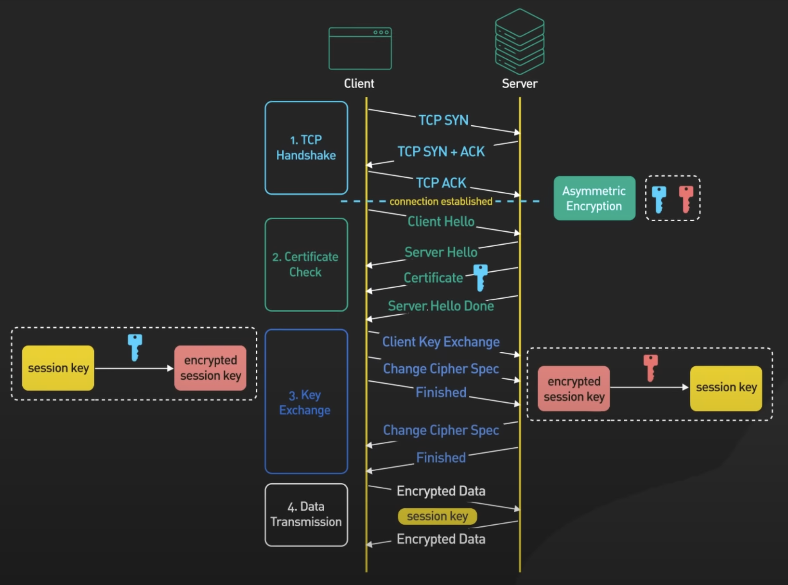

# Computer networks

> Concepts, principles, architectures. ISO/OSI and TCP/IP model, IP protocol, transport protocols (TCP, UDP). Network layer protocols, IPv4 features, advanced IPv6 features. Peer-to-peer (P2P) networks, ad-hoc/sensor networks, high-speed networks, computer networks and multimedia. Practical examples for all of the above (PA159, PA191).

[PA159 prednasky](https://is.muni.cz/auth/el/fi/podzim2021/PA159/um/)

[rozdil mezi PA159 a PA191](https://is.muni.cz/auth/discussion/predmetove/fi/podzim2016/PA159/65276746) -> nemel by byt zadny

## Concepts, principles, architectures

- **Idealni sit:** -> **NEEXISTUJE**

  - transparentni (ani nevime, ze komunikujeme pres sit)
  - neomezeny bandwith
  - bezztratova
  - bez latence/delay
  - zachovava poradi paketu

- **Typy siti:**

  - **Connection-oriented** (propojovane)
    - pro komunikaci se vyhradi exkluzivne kapacita (neni vyuzivana nikym jinym)
    - snadno se zajistuje QoS
    - drivejsi dratovy telefon
  - **Connection-less** (paketove)
    - kapacita site vyuzivana vsemi komunikujicimi
    - komunikace (data) se deli na pakety
    - tezko se resi QoS

- K stanovane jednotnych pravidel a zpusobu komunikace se vyuzivaji **protokoly**
  - sada syntaktickych (jak maji zpravy vypadat) a semantickych (jaky je vyznam zpravy) pravidel pro komunikaci nebo vymenu dat mezi systemy/zarizenimi/komunikacnimi partnery
- Architektury budto **peer-to-peer** nebo **klient-server**
- Smerovani (**routing**) probiha pomoci smerovacich tabulek routeru
  - na zaklade adresy (pripadne typu paketu = portu?)
  - paketu se podle tabulky urci dalsi smer, tzv. hop-by-hop princip
  - destinace se urcuje podle **CIDR** prefuxu adresy
  - smerovani je obvykle aktualizovano distribuovanymi algoritmy

## ISO/OSI and TCP/IP model

### ISO/OSI

- 7 vrstev
- kazda vrstva ma svou specifickou funkcionalitu
- komunikace jen s bezprostrednim sousedem
- referencni model pro studijni ucely, v praxi je vyuzivany TCP/IP

- Aplikacni (**Data**)
- Prezentacni (**Data**)
- Relacni (**Data**)
- Transportni (**Segmenty**)
- Sitova (**Pakety**)
- Spojova (**Ramce**)
- Fyzicka (**bity/signaly**)

### TCP/IP

4 vrstvy

- **Aplikacni**
  - poskytuje sluzby uzivatelum (web, mail)
  - pouzivaji se aplikacni protokoly (HTTP, SMTP, DNS, FTP), ktere jsou soucasti aplikaci
  - rozlisujeme:
    - peer-to-peer vs klient-server
    - pull (klient iniciuje prenos) vs push (server iniciuje prenos) model
- **Transportni**
  - dostane **data** -> vytvori **segmenty**
  - **TCP** nebo **UDP** protokol
  - zajistuje transport segmentu do cilove aplikace
  - adresovani pomoci portu (16-bit 0-65535)
  - end-to-end spolehlivost (cislovani segmentu, zalezi na poradi, dodani je potvrzeno)
  - kontrola spojeni, QoS (Quality of Service)
  - logicky komunikacni kanal, iluze prime komunikace
- **Sitova** (Internet layer)
  - dostane **segmenty** -> vytvori **pakety** (pokud UDP, tak **datagramy**)
  - **IP** (internet protocol)
  - zajistuje prenos paketu mezi komunikujicimi uzly
  - umoznuje adresovani kazdeho zarizeni na internetu pomoci IP adresy (IPv4 32bit, IPv6 128bit)
  - zajistuje smerovani paketu
    - topologie celeho internetu se tezko urcuje, dynamicky se meni (nodes se pripojuji a odpojuji)
    - kazdy router resi doruceni paketu na sve nejblizsi sousedy ve snaze dorucit paket blize cili na zaklade **smerovaci tabulky**
    - tabulka je upravovana **manualne** nebo **automaticky** pomoci **distribuovanych algoritmu**
      - **Distance Vector**
        - vse co vim reknu svym sousedum
        - **RIP** (Routing Information Protocol)
        - sousedici routery si periodicky/pri zmene vymenuji smerovaci tabulky ve kterych jsou informace o vzdalenostech (hop distance) k ruznym cilum (distance vector)
        - princip **Bellman-Ford** algoritmu
          - pocet uzlu = iteraci - 1 (6 uzlu = 5 iteraci)
          - complexity je O(u\*i)
          - **postup:**
            - udelame tabulku uzlu a jejich ceny (pokud uz nemame)
            - porade definujeme cenu (ohodnocene hrany) do jinych uzlu
            - pokud je uzel neobjeveny, skipujeme
            - iterace skonci, kdyz projedeme vsechny uzly (k neobjevenym uzlum se nevracime)
            - muzeme mit i mene iteraci, pokud se dve iterace nelisi v namerenych hodnotach
        - idealni pro male site, kde neni redundance
        - Dalsi protokoly jsou **IGRP**, **EIGRP** (enhanced IGRP - pridany support pro variable length subnet mask, kompletne nahradil IGRP)
      - **Link State**
        - vsem reknu informaci o svych sousedech
        - routery si vymenuji informace o stavu svych sousedu, je uchovavana topologie celkove site, kazdy si dopocitava svou routovaci tabulku
        - princip **Dijkstr** algoritmu
          - input: uzly, unvisited uzly, ohodnoceni cest
          - zacneme od nejmene ohodnoceneho uzlu z nevyhodnocenych uzlu
          - spocitame cestu do sousedicich uzlu pomoci ohodnoceni hran
          - odskrtneme uzel jako vyhodnoceny
          - vybereme nejmene ohodnoceny uzel
          - ... repeat to profit ...
        - protokol **OSPF** (open shortest path first)
        - robustnejsi, protoze si kazdy pocita routing tabulky sam
        - pro velke site
        - dalsi protokol je **IS-IS** (Intermediate System - Intermediate System)
      - **Path Vector**
        - distance vector, ale mimo ceny cest mame i jejich popisy
        - **BGP** (Border Gateway Protocol)
          - umoznuje routing pravidla (policies)
          - pouziva **CIDR** pro zefektivneni routovani
        - dalsi protokol je EGP (obsolete a nahrazeny BGP)
    - Je mozno vyuzit kombinaci protokolu - RIP, OSPF pro interni routovani v ramci site a pro externi routing skrze EGP/BGP (mezi domenami)
- **Sitove rozhrani** (Network access layer)
  - **data link layer**
    - dostane **packaty** -> vytvori **ramce** (🇬🇧 -> frames)
    - ramce obsahuji adresu odesilatele i prijemce
    - adresovani pomoci fyzickych/MAC adres
    - zajistuje spolehlivost fyzicke vrstvy (detekce chyb + korekce -> mozne diky redundanci - paritni bity/hamminguv kod)
    - **Hamming code:**
      - jaky ma kod delku? (treba 12bit)
      - jake jsou paritni bity? (nasobky 2 -> 1,2,4,8)
      - pro kazdy paritni bit spocitame hodnotu
        - paritni bit P0 = hodnota x0, skip x1, hodnota x2, skip x3, ...
        - kolik mame pocet 1? lichy = 1, sudy = 0
      - zkontrolujeme hodnotu paritniho bitu vypocitanou a hodnotu paritniho bitu z kodu
      - pokud nejake nesedi, oznacime je a secteme jejich hodnoty (P0 a P8 nesedi = 1+8 => 9. bit je spatne)
      - zmenime hodnotu 9. bitu a udelame vypocet znova pro kontrolu
    - **flow control** - resime u prijemce (**congestion control** se resi pro sit)
    - resi koordinaci pristupu vice zarizeni ke sdilenemu mediu (kanaly, rezervace, nahodnost, MAC protocol)
      - priority (vyhladoveni), round robin, weighted (round robin), atd..
    - na teto urovni lze zapojovat site do topologii (bus, hvezda, kruh)
  - **physical layer**
    - rozhrani ve forme framu bitu
    - poskutuje pristup k prenosovemu signalu
    - interne vrstva transformuje bity na signaly prenosoveho media, zajistuje synchronizaci, multiplexing
    - **Multiplexing:**
      - skloubeni vice signalu/datovych toku do jednoho pro prenos
      - casovy, frekvencni, vlnovedelkovy multiplexing a pote demultiplexing
    - medium muze byt drat, opticky kabel, vzduch

## IP protocol

- zajistuje doruceni paketu/datagramu (data rozrezana na kousky s obalkou) v ramci internetu (host-to-host)
  - i pres prostredniky (routery)
- skrze connection-less sit

## Transport protocols (TCP, UDP)

### TCP (Transmission Control Protocol)

- spolehliva spojovana sluzba
- uchovava poradi
- komunikace ustanovena skrze **3-way handshake** (**syn, syn&ack, ack**)
- komunikace jen end-to-end, routery to neresi
- nepodporuje multicast

- Hlavicka obsahuje:

  - zdrojovy port
  - cilovy port
  - sekvencni cislo (v ramci toku)
  - ack cislo - cislo dalsiho ocekavaneho bajtu, potvrzuje prijeti dat
  - delka hlavicky
  - flags (ack, reset spojeni, konec spojeni)
  - velikost okna (pro flow control)
  - checksum
  - options

- TCP meni mnozstvi poslanych dat v prubehu komunikace
  - prevence zahlceni (prijemce flow control, sit congestion control)
  - slouzi k tomu velikost okna
  - **postup:**
    - start = exponencialni zvysovani velikosti okna
    - dokud nedosahneme hranice
    - od teto hranice linearne zvysujeme
    - dojde ke ztrate paketu?
      - snizime na hranicni hodnotu
      - pokracujeme v linearnim rustu
  - **TCP Tahoe**
    - zaciname na 1
    - threshold treba 8
    - do 8 jedeme exponencialne
    - potom linearne
    - error = max value/2 = new threshold
    - start z 1
  - **TCP Reno**
    - jako Tahoe, ale po erroru zacina z noveho thresholdu linearne
      - tzv **"quick recovery"**

### UDP (User Datagram Protocol)

- jednoduchy
- poskytuje jednoduchou, best-effort sluzbu
- minimalni rezie
- rychlost
- pouziti v DNS, real-time prenosech, multicast

- Hlavicka obsahuje:
  - zdrojovy port
  - cilovy port
  - celkovou delku
  - checksum

## Network layer protocols

- **Application** = HTTP, SMTP, DNS, FTP
- **Transport** = TCP, UDP
- **Internet** = IPv4 (ARP, RARP, ICMP, IGMP), IPv6 (ICMPv6)
  - smerovani = distance vector (RIP, IGRP, EIGRP), link state (OSPF, IS-IS)
- **Network Access** = Ethernet, 802.11 (Wi-Fi)

## IPv4 features

- protokol pro komunikaci host-to-host
- 32bit, 0.0.0.0 - 255.255.255.255
- typy adres
  - unicast - 1:1
  - broadcast - 1:vsichni na LANu
  - multicast - zprava tem, kteri se prihlasili k odberu na dane multicast adrese

- Hlavicka obsahuje (20B):

  - **verzi** (ipv4)
  - **delku hlavicky**
  - **type of service** (pro zajisteni quality of service QoS)
  - **celkovou delku** (including data)
  - **identifikaci, flags**
  - **offset** (pri rozdeleni paketu na vicero)
  - **time to live** (dekrementovan pri kazdem hopu - hodnota 0 = zahozen)
  - **protokol** (specifikace protokolu vyssi urovne - ICMP, IGMP, TCP, UDP, OSPF)
  - **checksum hlavicky** (ne tela, to by bylo na dlouho a prepocitava se po kazdem hopu kvuli time to live (TTL))
  - **adresa odesilatele a prijemce**
  - **options** (testovani, debugging, volitelna cast diky "delky hlavicky")

- IPv4 obecne:
  - spolupracuje s protokoly
    - **ICMP** (internet control message protocol) - poskytuje informace o stavu site, info o chybe doruceni
    - **IGMP** (internet group management protocol) - sprava skupin pro multicast
    - **ARP, RARP** ((reverse) address resulution protocol) - preklad IP na MAC a vice versa
  - funguje multicast
  - puvodne se IP adresy rozdelovaly do trid
    - kvuli nedostatku adres se ale zacala pouzivat maska site (CIDR - classless inter-domain routing)
  - 127.0.0.1 = localhost = loopback

## Advanced IPv6 features

- resi problem nedostatku IPv4 adres
- 128bit delka
- `0000:0000:0000:0000:0000:0000:0000:0000` - `FFFF:FFFF:FFFF:FFFF:FFFF:FFFF:FFFF:FFFF`
- zkraceny zapis:
  - vynechani 4 nul a nahrazeni za jednu `1050:0000:...` -> `1050:0:...`
  - vynechani MAXIMALNE jedne sekvence nul `1050:0000:300c:...` -> `1050::300c:...`
- oproti IPv4:
  - IPSec je povinnou soucasti
  - delsi adresa - vice zarizeni
  - jednodussi hlavicka (chybi checksum, options, fragmentation)
  - podpora oznacovani toku a jejich priorit
  - podpora bezpecnosti, sifrovani, autentizace, integrity dat
  - ma i **anycast** - jako multicast, ale staci, aby se data dorucily jen jednomu clenu skupiny
  - odebrana fragmentace u dorucovani
    - odesilatel si musi sam pohlidat velikost paketu/datagramu
    - pri prilis velkem paketu se zasle ICMP zprava obsahujici max velikost na danem linku
  - odebrani checksum - resi se na jine vrstve
  - broadcast nahrazen specifickymi multicast skupinami

- Hlavicka obsahuje (40B):

  - verzi protokolu (ipv6)
  - prioritu
  - label toku
  - delka dat
  - dalsi hlavicka - rozsirujici o auth, options, atd..
  - hop limit
  - source a destination adresy

- Podpurny ICMPv6 rozsiruje funkcionalitu o to, co delal IGMP a ARP
  - nahrazuje i DHCP server
  - detekce kolizi ipv6 adres - odesle zpravu sam sobe a pokud nekdo odpovi, je to kolize
  - urceni MAC adres na stejnem linku
  - urceni sousedu
  - sledovani dostupnosti sousedu
  - funguje diky komunikaci pres multicast skupiny
- Podsite jsou stale definovane pres CIDR notaci (stejny prefix)

- Prechod z IPv4 na IPv6
  - nutnost upravy legacy systemu
  - slozitejsi zpracovavani IPv6 adres
  - idealne udelat simultalne aplikaci fungujici jak s IPv4 a IPv6
  - nebo enkapsulace IPv6 do IPv4 paketu
  - nebo prekladani (NAT)

## Peer-to-peer (P2P) networks

- system = vice identickych modulu = peery, ktere vzajemne komunikuji
- kazdy peer je klient i server zaroven
- u P2P neni treba znat celou topologii site

- **rozdil oproti Client-Server**:
  - lepsi skalovatelnost - vic klientu = vetsi vypocetni kapacita
  - decentralizace
    - pad 1 peeru neznamena pad celeho systemu
    - konzistence dat muze byt problem
  - promenliva topologie
  - sdileni vypocetni kapacity
  - sebeorganizace
  - client-server je jednodussi a zavedenejsi na vyvoj, snadneji se spravuje
  - client-server ma jasnou autoritu, ktera zajistuje bezpecnost a autenticitu dat
- **examples**:
  - distribuovane vypocty
  - torrenty
  - blockchain
- **vrstvy**:
  - **aplikace**
  - **middleware**
    - abstrakce nad overlay, poskytuje pristup ke sluzbam/zdrojum peeru, kontroluje pristup ke sluzbam/zdrojum, hledani a udrzovani zdroju
  - **base overlay**
    - vrstva nad fyzickou siti (obvykle TCP/UDP)
    - peery jsou jednotlive hopy (fyzicky ale muzou byt vzdaleni mrte daleko, v p2p ale sousedi)
    - peer discovery, preposilani zprav, udrzovani site
- **peer discovery**
  - **static** - peer ma predkonfigurovany seznam informaci o ostatnich peerech a zkousi pripojeni
    - nevhodne pro dynamicke systemy
  - **centralizovany registr** - udrzuje seznam aktivnich peeru, pouziva se pro discovery, registr je de facto server, single point of failure, provadi se health checky
- **topologie overlay** (jak jsou mezi sebou peery provazany)
  - **random mesh** = po discovery se k nekolika pripojim (vybiram podle latence - fyzicky blizke peery?)
  - **vrstvy** = peery jsou organizovane do vrstev
    - nejvyssi vrstva = nejspolehlivejsi
  - **mrizka/grid** = peery propojeni do mrizky (vicedimenzionalni a i okraje mohou byt propojeny), koordinaty peeru mohou byt pouzity k adresovani poskytovanych sluzeb

## Ad-hoc/Sensor networks

### Ad-hoc

- Sítě fungující bez předešlé existující infrastruktury
- využívající síťových schopností jednotlivců => distribuované
- Každý účastník funguje zároveň jako host
- oproti P2P

  - vetsi dynamicita topologie a mobilita ucastniku
  - ucastnici sami zodpovedni za pristup k prenosovemu mediu (casto vzduch => velka koliznost, interference)

- **examples:**

  - komunikace autonomnich automobilu
  - nouzove/zachranne situace - komunikacni infrastruktura
  - sledovaci tagy? airtagy?

- **deleni**:
  - **proaktivni** = pravidelna vymena informaci o stavu site (info o topologii)
  - **reaktivni** = flooding
  - hop-by-hop vs znalost cele topologie
  - flat vs hierarchicke (nadrizeni mohou mit vice zodpovednosti)

### Sensor networks

- obsahuji:
  - procesor a pamet
  - komunikacni modul
  - baterii (muze byt i sber energie - solarni panel)
  - samotny senzor (svetlo, pohyb)
- specifikem senzorovych siti je:
  - energicka efektivita
  - omezena vypocetni kapacita
  - omezena sirka pasma
  - mozna nespolehlivost
  - realizace docasneho uspavani v pripade neaktivity
- **examples:**
  - sledovani prirodnich jevu
  - detekce pozaru/zemetreseni/vln
  - zemedelstvi - sucho/skudci
  - rizeni dopravy
  - rizeni teploty v budovach
  - kvalita vzduchu
  - zabezpeceni objektu

## Computer networks and multimedia

- data slozene z ruznych typu medii (text, zvuk, video, obrazky)
- nektere media mohou byt analogove (nutnost konverze na digital)
- dulezita je komprece prenasenych dat
- muze a nemusi nam vadit chybovost

- **Delay:**

  - **processing delay**: overhead prijemce/odesilatele
  - **transmission delay**: doba presunu dat na prenosove medium
  - **propagation delay**: doba prenosu pres medium
  - **routing/queuing delay**: vytizenost site, jitter

- pro minimalizaci overheadu se pro realtime aplikace vyuziva UDP
- **interleaving** - sousedici snimky u videa preskladame tak, aby nesousedily
  - vypadne paket = ovlivneni vice casti s malym dopadem, namisto znatelneho vypadku cele casti
  - zvysuje latenci
- **prenos medii:**
  - diskretizovane - soubor, zprava
  - kontinualne - stream

## Glossary

### IPSec

- bezpecnostni mechanizmus
- zalozeny na kryptograficke bazi
- vytvoreni logical tunelu
- enkryptuje data (hashing)
- vytvori novy IP header
- potreba vytvoreni a vymeny klicu

### Jitter

- velikost kolisani pri odezve (latenci) v internetu

### SSL a TLS

- TLS je nastupce SSL
- SSL uz je obsolete

TLS 1.2 certificate and key exchange:

- TLS 1.3 je optimalizovany a je v nem mene roundtripu
