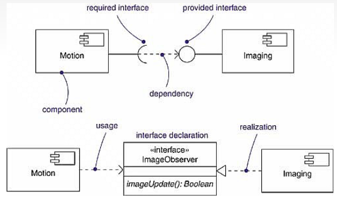

# Analysis and design of systems

> Object-oriented methods of information systems design. Requirements specification and management. Software architectures, component systems. Design and architectural patterns. Component interfaces, interface level contracts, OCL. Software system models, UML. Practical examples for all of the above. (PA103, PV167, PV258)

[PA103 prednasky](https://is.muni.cz/auth/el/fi/podzim2021/PA103/um/)

[PV167 prednasky](https://is.muni.cz/auth/el/fi/podzim2021/PV167/um/)

## Object-oriented methods of information systems design

- **Motivation:**

  - systemy byvaji slozite, spatne se udrzuji, je narocne zajistit/merit kvalitu
  - zaroven se casto meni naroky (requirements)
  - pomuze dekompozice systemu do mensich casti/komponent, ktere se efektivneji udrzuji/modifikuji
  - snadneji se meri kvalita

- pristupy a postupy k navrhu IS zalozenych na objektove orientovanem paradigmatu
- objekty jsou spojeni dat a mated
- pri modelovani je nutno definovat jednotny jazyk
  - reflektuje skutecnou terminologii pro danou domenu problemu
  - podle jazyku volime jmena funkci/trid
    - podstatna jmena = tridy/rozhrani
    - slvesa = metody/funkce
- objektove paradigma si rozumi s principy abstrakce
  - nejen objekty, ale i komponenty
- **metody:**
  - modelovani pomoci UML (Unified Modeling Language)
  - dekompozice systemu do mensich casti
  - aplikace navrhovych a architektonickych vzoru
    - resi dobre zname a caste opakujici se problemy (nejen v objektovem svete)

## Requirements specification and management

- Pozadavky se deli na:
  - **Funkcni pozadacky** = jake funkce od systemu ocekava, business logika, uzivatelske pozadavky, resi se programove (v implementaci)
  - **Nefunkcni pozadavky** = technicke naroky na system, pouzite technologie, OS, garance dostupnosti, response time, internacionalizace a lokalizace
    - internacionalizace = podpora vice jazyku pro jeden SW
    - lokalizace = prizpusobeni SW v konkretni lokalite (jine UI, format datumu/casu, mena)
- Soucasti rizeni pozadavku je:
  - porozumeni domene problemu
  - sber pozadavku od stakeholderu (ptat se **PROC**)
  - analyza a jednani (jop, tohle pujde; nope, tohle nepujde)
  - specifikace pozadavku (uprava do jednoznacne/formalni podoby - use case)
  - validace pozadavku (overeni, ze formalni pozadavky odpovidaji skutecnym potrebam)
  - prioritizace pozadavku
- Dobre specifikovany pozadavek je:
  - reflektujici skutecne potreby zakaznika a je v nem obsazeno **PROC**
  - jasne kriterum splneni, je meritelny a testovatelny
  - ma prioritu
  - je uplny
- cim pozdeji pozadavek upravujeme, tim je to nakladnejsi (casove i financne)
- pozadavky se modeluji pomoci **use case diagramu**
  - uchovavaji se v **use case dokumentu**
    - id, jmeno, actors, popis, trigger, pre/post conditions, typicky flow, priorita, vyjimky, frekvence pouzivani, ...
  - taktez se uchovavaji pomoci jednoduche formalni formy - **user stories**
    - **Template:** `As <role> I want to <action> So I can <justification>`
    - srozumitelny zakaznikovy
    - \+ obsahuje akceptacni kriteria, story points
- priorita se urcuje:
  - klasicke ohodnoceni 1-10
  - binarni strom
    - pozadavky uchovavany v uzlech (prioritnejsi = doprava, jinak doleva)
  - **MoSCoW** = Must (critical), Should (major), Could (minor), Wont
- nefunkcni pozadavky plati vzdy
  - treba kontrolovat s nove prichozimi funkcnimi pozadavky
  - vytvorime wiki/dokumentaci nefunkcnich pozadavku
  - muzeme linknout nefunkcni pozadavky s user stories (pristup k aktualnim datum senzoru - `system poskytne odezvu do 1 vteriny` <- NFR (non-functional requirement))

## Software architectures, component systems

- SW architektura urcuje zpusob strukturovani systemu
- jak se deli na komponenty/moduly
- jak mezi sebou jednotlive pieces komunikuji/interaguji
- jak jsou casti systemu nasazeny na HW
- **SW architektury** = vyssi abstrakce
- **architektonicke vzory** = nizsi abstrakce
- seznam SW architektur:
  - MVC/MVP/MVVP pattern
  - Klient-server
  - Peer-to-Peer
  - layered architecture
  - microkernel
  - pipes and filters
  - SOA (service-oriented architecture)
  - Microservices
- Komponenty:
  - interni spustitelne jednotky
  - definovane komunikacni rozhrani
  - blackbox - do vnitrniho chovani nevidime/nezajima nas
  - vrstva abstrakce
  - vyvoj muze byt nezavisly
  - nahraditelnost komponent
  - znovupouzitelnost na ruznych mistech systemu
  - mohou mit vnitrni stav (problem s paralelizaci)
  - mohou byt asynchronni (neblokujici)
  - mohou byt hierarchicky slozeny z dalsich komponent

## Design and architectural patterns

- **navrhove vzory:**
  - obecne reseni pro casto se opakujici problem
  - nejen jako obecny navod pro implementaci, ale taky jako komunikaci v tymu (tady pouzijeme Builder pattern)
  - je potreba vzory pouzivat s rozvahout (neoverengineerovat)
- **Architektonicke vzory**
  - [predchozi sekce](#software-architectures-component-systems)

### GoF (Gang of Four) Patterns = design patterns

- Ukazky kodu: [github projekt](https://github.com/alesed/gof-design-patterns/tree/main/src)

#### Creational patterns

- **Singleton**: instanciace pouze jednou, pri pokuzu o ziskani objektu vracime existujici instanci (pokud existuje)
- **Prototype**: klonovani existujiciho objektu a vytvoreni nove instance se stejnymi parametry
- **Factory Method**: tvorba instanci tridy stejneho typu s jinymi parametry
- **Abstract Factory**: tvorba instanci trid stejneho parenta (extends)
- **Builder**: konstrukce objektu pomoci metod a nasledny BUILD - instanciace

#### Structural patterns

- **Bridge**: TV - remote control - abstrakce nad slozitejsim objektem
- **Proxy**: osetreni komunikace s instanci vytvorenim prostrednika (driver - car)
- **Composite**: graficke objekty a groupovani - abstrakce chovani nad polem objektu stejneho/podobneho typu
- **Adapter**: komunikace se zdanlive nekompatibilnim systemem (legacy/new system)
- **Facade**: vrstva nad services (abstrakce chovani vicero sluzeb do jedne tridy)
- **Flyweight**: Sdileni pouziti jednoho objektu - uchovavame stav - uspora pameti/vypoctu
- **Decorator**: rozsireni trid o novou funkcionalitu - nemeni rozhrani, ale rozsiruje jej

#### Behavioral patterns

- **State**: jednoduchy prechod stavu v systemu pomoci contextu a referenci na dalsi stav
- **Command**: request/pozadavek je nezavisly objekt, ktery drzi vsechny informace/implementace chovani - muzeme commandy referencovat dale v kodu a volat jako callbacky
- **Mementum**: uchovavani predchozich stavu, moznost rollbacku
- **Chain of Responsibility**:
- **Iterator**: vytvoreni rozhrani k pruchodu kolekce prvku - hasNext(), next()
- **Visitor**: umoznuje spousteni stejne akce/vypoctu nad ruznymi objekty. Objekty maji implementaci rozlisnou, ale jednotne je rozhrani
- **Observer**: registrovani observeru do subsriberu, komunikace se vsemi observery pomoci jedne metody (notifyAll() treba)
- **Strategy**: dynamicke rozhrani poskytujici injection (vlozeni) chovani/vypoctu pozadavku dle potreby - v momente, kdy presne nevime vsechny moznosti/chceme vypocet casto menit

## Component interfaces, interface level contracts, OCL

- **OCL** = Object Constraint Language
  - deklarativni jazyk
  - popis kontraktu a jejich constraints (omezeni domen hodnot)
  - vcetne zavedeni do UML
- komunikace komponent s okolim pomoci verejneho rozhrani = **signatura**
  - obsahuje operace (metody/funkce) + jejich vstupni a vystupni parametry
- rozhrani ma i jine **omezeni** - podminky (treba uzivatel se muze registrovat jen jednou, uzivatel musi mit vice jak 18 let, ...)
- Signatura + omezeni = **kontrakt**
- Soucasti kontraktu je:
  - **preconditions**: co plati pred vyvolanim metody? (mame dost penez na uctu)
  - **postconditions**: co plati po skonceni metody? (probehne platba, strhne se castka z uctu)
  - **invariants**: co plati vzdy (vaze se nejen k metodam, ale i objektum)? (debetni ucet nesmi jit do minusu)
- Pri definici kontraktu nesmime porusit jeden ze SOLID principu - **Liskov Substitution Principle**
  - dedic muze invariants a postconditions pouze utahovat (byt vice striktni - co platilo pro parenta, plati i pro childa)
  - u preconditions muze child podporovat vice vstupu nez predek

## Software system models, UML

- zjednoduseny pohled na SW system
- model je vlastne abstrakce
- ruzne modely se zabyvaji ruznymi aspekty vyvoje systemu
- potreba mit vzajemnou konzistenci mezi modelama
- **UML** je modelovaci jazyk umoznujici jednotny zpusob vizualizace navrhu systemu
  - pro verzovani mozno vyuzit **PlantUML** - deklarativni kod, ktery prislusne diagramy nasledne generuje

### Structural diagrams

#### Context diagram

- kontext a prostredi, v jakem system funguje
- interakce s externimi systemy a skupinami uzivatelu

- neresime casti, se kteryma na primo neinteragujeme (to dela [ecosystem map](#ecosystem-map))

#### Use case diagram

- zahrnuje vsechny uzivatele a jine systemy ve forme **actors**, kteri system pouzivaji
- kazdy actor ma dostupne akce (**use case**) a pripadne vazby mezi akcemi
  - **extend vazba** = potrebujem najit telefonni cislo -> potrebujeme pro spravny vysledek vykonat akci "vyhledat ve zlatych strankach"
  - **include vazba** = checkout kosiku -> zaroven musime vykonat akci "check login"

#### Conceptual class diagram

- diagram trid, ale neresime jej do detailu
  - chybi datove typy, metody
- zajimaji nas pouze klicove entity (tridy), jejich data a vazby mezi entitami
- ujasnuje terminologii

#### Class diagram

- staticka reprezentace systemu ve forme trid
- soucasti jsou metody, atributy a vzajemna provazanost (vazby)
- vztahy maji kardinalitu
- **Asociace** = sipka (nebo bez sipky pro oboustranny vztah) - popisuje vztah danych trid
- **Agregace** = bily kosoctverec - popisuje, ze trida obsahuje druhou tridu (ta kterou obsahuje ma u sebe kosoctverec)
- **Kompozice** = cerny kosoctverec - popisuje, ze trida je nedilnou soucasti jine tridy

#### Object diagram

- zachycuje system za behu v urcitem case
- zobrazuje konkretni objekty a jejich vazby

### Behavioral diagrams

#### Activity diagram

- popisuje workflow systemu/komponent
- jednoduchy na pochopeni i pro lajka (zakaznika)

#### Sequence diagram

- popisuje interakce v case mezi jednotkami v systemu
  - tridy/komponenty/actors

#### Deployment diagram

- popisuje jednotlive komponenty systemu a jejich komunikacni toky
  - vcetne pouzitych technologii

#### Component diagram

- popisuje komponenty a jejich kompozici v systemu
- **tridni notace** (vazby vcetne deklarace interface)
- **lollipop notace** (required interface + provided interface)

## Glossary

- **Validace**: Model odpovidat 1:1 Pozadavkum (most je postaveny v miste, kde bylo planovano)
- **Verifikace**: Implementace odpovida 1:1 modelu (most je postaveny spravne dle navrhu)

- **Problem s cyklickou vazbou objektu** - **instanceObjektu.toString()**, objekt muze obsahovat referenci na parenta i childa a nekonecne se cyklit

  - je treba zarucit, abychom se necyklili
  - muze byt vhodne navrhnout specialni objekty s jasnou hierarchii a bez cyklu

- **Interface Definition Language** - popisuje rozhrani formou, ktera je nezavisla na programovacim jazyce
  - **OpenAPI** pro **REST**
  - **WSDL** (Web Service Definition Language) pro SOAP, COBRA IDL
  - **Protocol Buffers** pro **gRPC**

### Ecosystem map

- znazornuje cely kontext (vcetne casti, se kteryma na primo nekomunikujeme)

### Analytical patterns

- navrhove vzory nabizi reseni na casto resene problemy n **NAVRZICH** systemu
- casto velmi sofistikovane
- pouzivat s rozvahou!

#### Accountability

- koncept popisuje osobu nebo organizaci, ktera je ve vazbe s dalsi osobou/organizaci
- abstrakce reprezentujici spoustu specifickych problemu
  - organization structures
  - contracts
  - employment
- **vzory:**
  - **Party** - nazev pro osobu, organizaci (obsahuje menici se hierarchie)
  - **Organization Hierarchies** - resi problem reprezentace organizace skladajici se z casto menicich se hierarchii (organizacnich jednotek)
    - reseni je mit stavebni blok `Organization`
    - vytvareni vazeb, ne novych trid
    - dedeni od master bloku
  - **Organization Structure** - ^^ jako org. hierarchies, ale muzeme pridat verzovani v case a typ struktury
  - **Accountability** - ^^ jako org. structure, ale organizaci nahradime party (a vztahu rikame party)
  - **Accountability Knowledge Level** - ^^ jako accountability, ale mame jak `party type`, tak `accountability type`

#### Obervation & Measurement

- Ulozeni a sprava kvantitativnich a kvalitativnich dat
  - vyska, sirka, vaha, krevni tlak, ...
- alternativa k numerickym atributum

- **vzory:**
  - **Quantity** - kvantita ma jednotku a hodnotu
  - **Conversion Rate** - prevadeni z jedne jednotky na druhou (jen pro linearni vztah)
  - **Compound Units** - jednotka muze byt slozena z vicero atributu (km/h)
  - **Measurement** - reprezentace vysledku mereni (nekym vykonano, zkoumal se nejaky fenomen a zajistilo nejakou hodnotu)
  - **Observation** - jako measurement, ale s tim, ze zaznamenavame mereni s nejakou kategorickou hodnotou (pocet lidi s danou krevni skupinou)
